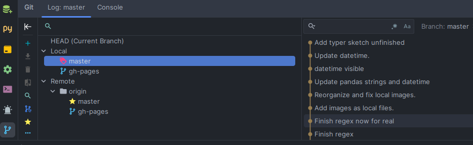
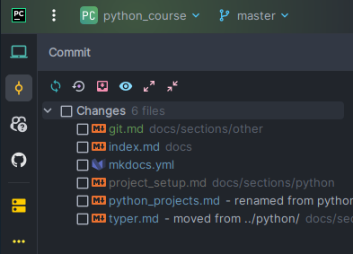
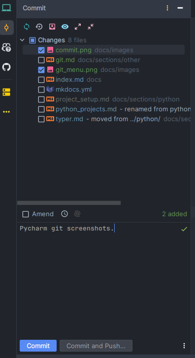
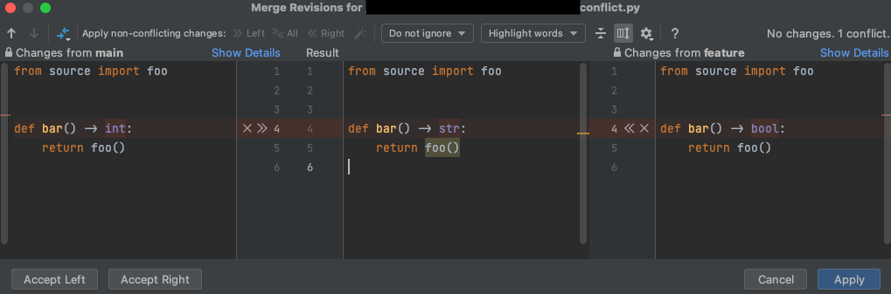

# Git

Git is a free and open source software for distributed version control[^1]. Git works by keeping track of changes in
files, and it is very useful when working in teams, since it allows to merge changes from different people in the same
file.

[^1]:
    More info: <http://rogerdudler.github.io/git-guide/>

Git is like a tree, where each node is a commit. Each commit has a parent commit, except for the first commit, which
has no parent. 

Some basic git words that we will encounter often are:

* **commit**: a snapshot of the repository at a certain point in time. Each commit has a unique identifier (hash).
* **branch**: since git is like a tree, a branch is a line of commits.
* **master**: the default branch (lately, this is being considered a bad name, and it is recommended to use `main` 
instead).
* **develop**: branch where we merge all the features that we are developing. When we are ready to release a new
version, we merge `develop` into `master`.
* **origin**: the (default name of a) remote repository. This basically means the repository saved in GitHub, 
Bitbucket, etc.
* **merge**: when we merge two branches, we take the changes from one branch and apply them to the other branch. After 
the merge, the two branches will be the same.
* **push**: send changes from a local repository (your computer) to a remote repository (github, bitbucket, etc).
* **pull**: send changes from a remote repository to a local repository. We use this when we are working in a team, and
we want to get the changes that other people have made to the remote repository into our local repository.

## Installation

To install git, follow the instructions [here](https://git-scm.com/book/en/v2/Getting-Started-Installing-Git) for 
your operating system.

## Configuration

After installing git, we should configure it with our name and email. This is important, since git will use this
information to identify the author of each commit. To do so, we can use the following commands:

```bash
git config --global user.name "Your Name"
git config --global user.email "some_email@some_domain.com"
```

## Creating a repository

To create a new repository, we should go to the folder where we want to create it, and use the command `git init`.
This will create a new folder called `.git` in the current directory. This folder will contain all the information 
about the repository (the folder should never be modified manually).

## .gitignore

A `.gitignore` file is a text file that tells git which files or folders from our repository to ignore. 
This is useful to avoid committing files that we don't want to share with other people, such as temporary files 
or files with passwords.

A .gitignore file should be placed in the root directory of our repository. We can create it manually. For example,
if we want to ignore all files with extension `.csv` inside our folder `data`, we can write the following in our 
`.gitignore` file:

```bash
data/*.csv
```

## Git commands

### Using git from Pycharm

Pycharm has a built-in git client, which uses git commands under the hood in a graphical, friendly interface. 
To use it, we should first create a new project from an existing repository. 
Then, we can use the git menu on the bottom left of the IDE to check branches and perform other common git operations.

<figure markdown>
  { width="600" }
  <figcaption>The git menu, displaying local and remote branches.</figcaption>
</figure>

When we want to commit changes, we can use the commit menu on the top left of the IDE:

<figure markdown>
  { width="300" }
  <figcaption>The commit menu, displaying files that have changed.</figcaption>
</figure>

To create a new commit, we should first select the files that we want to commit, and then write a commit message:

<figure markdown>
  { width="300" }
  <figcaption>Creating a new commit from the commit menu.</figcaption>
</figure>

If there are no conflicts (i.e., if the files that we want to commit have not been modified by other people at the
same place), then the commit will be created. Otherwise, we will have to solve the conflicts manually. In this case,
Pycharm will show us the conflicts and allow us to solve them:

<figure markdown>
  { width="600" }
  <figcaption>Pycharm showing us the conflicts in a file.</figcaption>
</figure>

!!!note
    Other IDEs, such as VSCode, also have built-in git clients. For VSCode, see 
    [here](https://code.visualstudio.com/docs/sourcecontrol/overview). 

### Basic terminal commands

We can also use git from the terminal. The most common commands are:

* `git init`: when in a folder, initiate a (new) repository
* `git clone /path/to/repository`: create a working copy of a repository. When the repository is in a remote server, 
your command will be 
    ```bash 
    git clone username@host:/path/to/repository
    ```
* `git add <filename>`: add files to the repository. 
* `git status`: indicates what files have changed since the last commit.
* `git commit -m "Commit message"`: create a commit of the repository. The message should indicate what's new in 
this commit.
* `git fetch --all`: downloads commits, files, and refs from a remote repository into your local repo. 
Fetching is what you do when you want to see what everybody else has been working on.

### Branches and merging

* `git branch`: list all branches in a repository
* `git branch branch_name`: create a new branch called branch_name
* `git checkout branch_name`: switch to branch `branch_name` (which should already exist) 
* `git merge branchname`: merges branchname to current branch. If there are conflicts, they will remain unmerged. 
    You can decide what to do case by case in your IDE. It's a good idea to delete the branch after, if you will not
    work in it anymore.

    !!!note
        It is recommended to merge from the IDE (e.g. Pycharm), since it is easier to decide what to do in the case of
        merge conflicts. 

* `git pull`: update your local repository to the newest commit of the (remote) branch. This command is equivalent to
  `git fetch` followed by `git merge`.
* `git push [origin/other_remote_name] [branch_name]`: send changes from last commit of local branch to `branch_name` 
   on your remote repository. If the local branch does not exist on the remote repository, we should use
   `git push -u origin [branch_name]` (`-u` is short for `--set-upstream-to`).
* `git remote add origin <server>`: connect your repository to a remote server. In "server" we would put the url of a 
   github repo, e.g. https://github.com/gerardpc/somerepo.git or `git@bitbucket.org:gerardpc/somerepo.git`. 
   To remove a remote repository, use `git remote rm <remote-name>`. To see the current remote repositories, use
   `git remote -v`.
* `git branch -d branchname`: delete a branch
* `git branch -m new_name`: rename the current branch

## Other useful tricks

By default, github will ask you for your username and password every time you push changes to a repository. To avoid
this, you can use ssh keys. To do so, follow the instructions [here](https://kamarada.github.io/en/2019/07/14/using-git-with-ssh-keys/).
