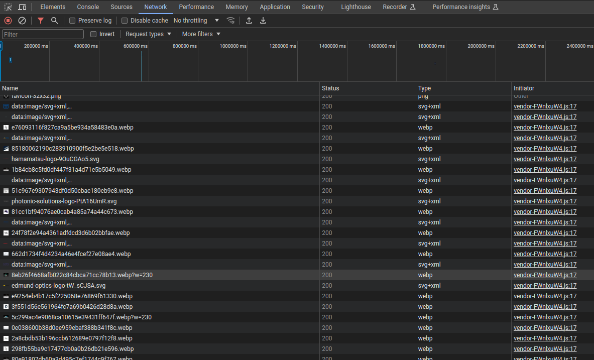
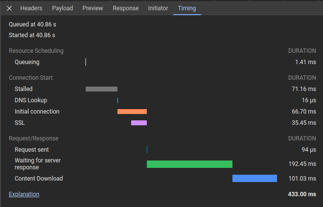
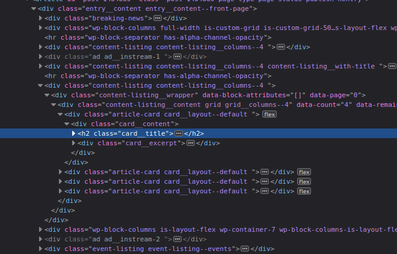

# Web scraping

## Introduction

Web scraping is the process of extracting information from websites programmatically. In web scraping,
we use a program to download the HTML content of a web page and extract the data we need in an automated way.
It is a useful technique to collect data from the web, and it is widely used in many fields.

## Some background

HTML is the language in which websites are written. However, most modern webpages are built with
Javascript, a language that renders the HTML and that is used to make pages interactive. This means that 
after the page loads, the content of the page can change without the need to reload the entire page. 

This interactivity is achieved by making requests to a server and getting the data back in a format 
that can be inserted into the page. For example, when you search for something on Google, the page you see is not
pre-rendered and sent to you. Instead, it is generated on the fly by the server. 

<figure markdown>
  { width="700" }
  <figcaption>Sketch of the parts of a website.</figcaption>
</figure>

The previous paragraphs hint at a fundamental distinction in web development: the **front-end** and the **back-end**. 
The **front-end** of the website is the part that is rendered in your browser, whereas the **back-end** is the part that
runs on the server (where the databases are stored and the data is processed). And when you interact with a website, you
are typically sending data to the server (e.g., by filling a form) and the server is sending data back to you. 

The data that is sent back and forth between the server and the client (your browser) is usually in JSON format, and is 
sent using AJAX (Asynchronous Javascript and XML) calls. The connection between the client and the server is usually 
performed using an API (Application Programming Interface) which is a set of rules and protocols that allow 
different software applications to communicate with each other.

## How do I get the data?

The end goal of web scraping _in Python_ is to get data from a website and store it in a Python object; after, we can
save it in our favorite format (e.g., CSV, Excel, or a database). There are several ways get this data:

1. **Using a web scraping library** (the classical way): there are many libraries in Python that can 
help you with web scraping. Some of the most popular are:

    * `BeautifulSoup`: a library that essentially treats a web page as a tree of nested HTML tags (as if it were a 
      dictionary). By moving through the tree, you can extract the data you need. It is useful when the data 
      you need is in the HTML content of the page.
    * `Selenium`: a library that allows you to control a web browser programmatically. It is useful when you need to
      interact with a web page, for example, to click on a button or to fill a form. It replicates the actions of a real
      human, and it is useful when the data you need is not in the HTML content of the page, but is generated by Javascript
      after the page loads.
    * Sometimes you can even get away with just Pandas.
   
2. **Using an (official) API**: many websites provide an API that allows you to access their data in a structured way. If we
can use an API, that should always be our first choice, as it is usually faster and more reliable than web scraping. 
However, not all websites provide an API, and sometimes the API does not provide all the data we need.
3. **Using an (unofficial) API**: if a website does not provide an official API, we can sometimes still access its data
by reverse-engineering the calls that the official app or website makes to the server. This is usually more difficult 
than using an official API, and it is also more likely to break in the future, as the website can change the way it 
sends and receives data at any time. _But_, if we are able to discover one, it is a faster and more 
reliable way to get the data we need.

!!!note
    Web scraping is a powerful tool, but it should be used responsibly. Always check the `robots.txt` file of a website
    before scraping it, and never scrape a website that does not allow it. Also, be aware that web scraping can put a
    heavy load on the server of the website you are scraping, so always be respectful of the website's resources.
    If you make too many requests in a short time, you may be blocked from accessing the website.

## Web scraping in practice

### Using an official API

When a website provides an official API, it almost always provides documentation on how to use it. Read the documentation
to understand how to make requests to the API and how to interpret the data that is returned.

### Using an unofficial API

To discover an unofficial API, we can use the Developer Tools of our browser. When we load a page, the browser makes
several requests to the server to get the data it needs to render the page. We can see these requests in the **Network** 
tab of the **Developer Tools** (which we can access by pressing `F12` in most browsers). 

<figure markdown>
  { width="700" }
  <figcaption>All requests from a particular website.</figcaption>
</figure>

By inspecting the requests, we can often find the URL of the API and the parameters that are sent
to it. If we filter the requests to XHR, we might be able to find some of them that return a JSON object, such as
the one in the image below:

<figure markdown>
  { width="500" }
  <figcaption>A request that returns a JSON file.</figcaption>
</figure>

If we right-click on the request and select "Copy" -> "Copy as cURL", we can get the cURL command that was used to make
the request. We can then use this command to make the same request from Python using the `requests` library.

!!!note
    The `requests` library is a powerful tool for making HTTP requests in Python, and it is the most common way to
    interact with APIs and to scrape websites. 

!!!note
    An easy way to convert a cURL command to a Python request is to use a tool like ChatGPT (just paste the cURL command 
    in the chat and ask for the Python equivalent with the `requests` library). Then, with a few modifications, we can
    probably use similar code to get other data from the website.


### Using Pandas

Sometimes, we can get away with just using Pandas. For example, if the data we need is in a table in a webpage, we can
use the `read_html` function of Pandas to get the data directly into a DataFrame. This function searches for `<table>`
tags in the HTML content of the page and returns a list of DataFrames, one for each table in the page.

```python
import pandas as pd

url = 'https://en.wikipedia.org/wiki/History_of_Python'
dfs = pd.read_html(url)

# The first table in the page
table = dfs[0]
print(table)

# Output
#     Year  Version  Release date
# 0   1989  Python 0.9.0  February 20, 1991
# 1   1991  Python 1.0  January 26, 1994
...
```

To use this method we need to install the following libraries:

```bash
pip install lxml html5lib beautifulsoup4
```

!!!note
    This method only works in extremely simple cases. If the data we need is not in a table, 
    we will have to use one of the other methods.


### Using BeautifulSoup

When the data we need is in the HTML content of the page, we can use BeautifulSoup to extract it.
The [documentation](https://www.crummy.com/software/BeautifulSoup/bs4/doc/) is not very long, and it is worth reading.
As indicated before, BeautifulSoup treats the HTML content of a page as a tree of nested tags,
and we can move through the tree to extract the data we need.

The most important methods of the `BeautifulSoup` class are:

* `find`: returns the first element that matches the given criteria.
* `find_all`: returns a list of all elements that match the given criteria.
* `get_text`: returns the text of the element and all its children.
* `get`: returns the value of the given attribute of the element.

We can see an example of how to use BeautifulSoup to extract data from a webpage in the following code:

```python
import requests
from bs4 import BeautifulSoup

url = 'https://en.wikipedia.org/wiki/History_of_Python'

# Get the HTML content of the page
response = requests.get(url)
html = response.content

# Create a BeautifulSoup object
soup = BeautifulSoup(html, 'html.parser')

# Get the data we need
data = soup.find(id='mw-content-text').get_text()
print(data)
```

In the previous code, we use the `requests` library to get the HTML content of the page, and then we use BeautifulSoup
to extract the data we need. 

In the following example, we extract data from a news website:

```python
import requests
from bs4 import BeautifulSoup

url = 'https://www.politico.eu/'

# Get the HTML content of the page
response = requests.get(url)
html = response.content

# Create a BeautifulSoup object
soup = BeautifulSoup(html, 'html.parser')

# Get the data we need
headlines = soup.find_all('h2', class_='card__title')
for headline in headlines:
    print(headline.get_text())
```

In the previous example, we know that this is the class of the headlines because we inspected the HTML content
of the page using the Developer Tools of our browser and found this:

<figure markdown>
  { width="500" }
  <figcaption>Inspecting the HTML content of a page.</figcaption>
</figure>

!!!note
    The examples provided are very simple, but already show the power of web scraping. In practice, we will often need
    to use more complex criteria to extract the data we need (e.g., regular expressions, string parsing, etc.).


### Using Selenium

When the data we need is not in the HTML content of the page, but is generated by Javascript after the page loads, we can
use Selenium to interact with the page and get the data we need.

```python
from selenium import webdriver

url = 'https://en.wikipedia.org/wiki/History_of_Python'
driver = webdriver.Chrome()
driver.get(url)

# Get the data we need
data = driver.find_element_by_id('mw-content-text').text
print(data)

# Close the browser
driver.quit()
```