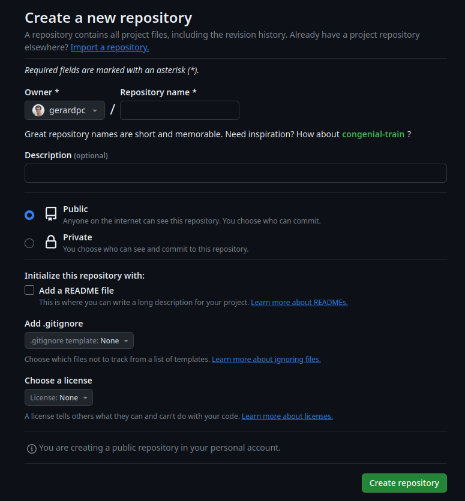

# Python projects

## Introduction

In this section we will learn how to create a Python project from scratch. This project will be hosted in a
remote repository, and we will learn how to create a Python package from it.

We will use [Poetry](https://python-poetry.org/) to manage our project dependencies (i.e., the libraries that
our project uses), and the following extra tools to help us with the development process:

* **Git**: the most popular version control system. This will allow us to keep track of the changes in our code
between different versions of our project.
* **GitHub**: a website to host our remote repository (although we could use other alternatives, such as 
[GitLab](https://about.gitlab.com/) or [Bitbucket](https://bitbucket.org/)). This will allow us to share our code
with other people and to collaborate with them.
* **Typer**: a library to create command-line interfaces (CLIs) in Python. This will allow us to create a 
program that uses our Python code and can be executed from the terminal.
* **Ruff**: an (extremely fast) Python linter and code formatter. This will help us to keep our code clean and
consistent, following a "standard" style of writing Python code.

If we have more time, we can also add to our project:

* **Pytest**: a library to create unit tests in Python.
* **[NiceGUI](https://nicegui.io/)**: a library to create quick graphical user interfaces (GUIs) in Python in web browsers (other alternatives
are [Streamlit](https://streamlit.io/) and [Dash](https://plotly.com/dash/)).

!!!note
    Some basic nomeclature:

    * **Python module**: a file containing Python code. It can be imported by other Python modules.
    * **Python package**: a directory containing several Python modules or other Python packages. Very

    often, a Python package will also contain a `__init__.py` file, which is a Python module that is executed
    when the package is imported (but it is not necessary to have it). A Python package can be imported by 
    other Python modules.

## Project structure

A Python project should have a clean directory structure. This makes it easier to organize the code and to add new
commands and arguments.

The following is a possible directory structure for a Python machine learning project called `my_project` 
(which is the name of the directory that contains the project):

```bash
.
├── README.md
├── .gitignore
├── pyproject.toml
├── poetry.lock
├── my_project
│   ├── config
│   ├── data
│   ├── cli
│   ├── models    
│   └── __main__.py
├── notebooks
└── data
    ├── raw
    ├── processed
    └── results    
```

In the previous directory structure, we have the following files and directories:

* `README.md`: a file containing a description of the project. This file is written in Markdown, a markup language
* `.gitignore`: a file containing the names of the files and directories that we want to ignore when we commit. For
more information, see [the git section](../other/git.md).
* `pyproject.toml`: a file containing the configuration of our project. This file is automatically generated by
Poetry and (in general) we should not modify it manually.
* `poetry.lock`: a file containing the exact versions of the libraries that we are using in our project. This file
is automatically generated by Poetry, using the information in `pyproject.toml`, and (in general) we should not
modify it manually.
* `my_project`: a directory containing the actual Python modules and packages that we have created for our project.
The name of this directory should be the same as the name of our project. Inside this directory, we have the following:
    * `config`: a directory containing code for loading and saving configuration files (configuration files typically
      are `.json` or `.yaml` files, that contain the parameters of our models).
    * `data`: a directory containing Python modules and packages that contain the code for loading and saving data.
    * `cli`: a directory containing the code for our CLI. This directory typically contains a `main.py` file, 
      which is the entry point of our CLI, and several other Python modules and packages that contain the code for
      the different commands and arguments of our CLI. We will create this CLI with Typer 
      (see the corresponding [section](../python_libraries/typer.md)).
    * `models`: a directory containing Python modules and packages that contain the code for our machine learning models.
    * `__main__.py`: a file that is executed when we run `python -m my_project` from the terminal. This file typically
      contains the code to run our CLI.
* `notebooks`: a directory containing Jupyter notebooks, or other python scripts for exploratory data analysis (EDA).
These files are temporary, and once ready, anything important should be moved to the Python modules and packages in 
`my_project`.
* `data`: a directory containing the data for our project. This directory typically contains the following:
    * `raw`: a directory containing the raw data for our project (i.e., the data that we have downloaded from the
      internet or that we have received from other people).
    * `processed`: a directory containing the processed data for our project (i.e., the data that we have created
      from the raw data).
    * `results`: a directory containing the results of our project (i.e., the data that we have created from the
      processed data).

!!!note
    Of course, this is just a project structure suggestion. You can adapt it to your own needs.

## Creating our project with Poetry

### Poetry introduction

[Poetry](https://python-poetry.org/) is a tool for dependency management and packaging in Python. It allows us to
define the libraries that our project uses in a `pyproject.toml` file (which is a standard file in all proper
Python projects). With all the constraints defined in this file, Poetry will automatically install the correct
versions of the libraries that we need in our project (the versions that are compatible with each other), and save
them in a `poetry.lock` file.

Under the hood, Poetry uses [pip](https://pip.pypa.io/en/stable/) to install the libraries. However, it is not
recommended to use pip directly, since it does not have a way to lock the versions of the libraries that we are
using.

!!!note
    Poetry is not the only tool for dependency management and packaging in Python. Other popular alternatives are
    [pipenv](https://pipenv.pypa.io/en/latest/) and [conda](https://docs.conda.io/en/latest/).

### Creating the project

To create a new project, we should follow these steps:

1. Create a new directory for our project. It should be named the same as our project.
2. Open a terminal and navigate to the directory that we have just created.
3. Run the following command:

    ```bash
    git init
    ```

    This will initialize a new git repository in our project.

4. Manually create the files 
    * `README.md`
    * `.gitignore` (see [the git section](../other/git.md)).
   You can fill these files later.
   
5. Create a new virtual environment for the project. 

    !!!note
        A virtual environment is a directory that contains a copy of the Python libraries, specific for your project.
        You should create a new virtual environment for each project that you create. This will allow you to have
        different versions of the same library in different projects, and to avoid conflicts between them.
 
    If you are using PyCharm, click on the bottom right corner
    of the window, where it says "No interpreter", and select "Add new interpreter", and then "Add local environment".
    A pop-up window will appear:

    <figure markdown>
      { width="600" }
      <figcaption>Creating a new virtual environment for the project.</figcaption>
    </figure>

    Select "Virtualenv Environment", and modify the name of your virtual environment folder: this is the name that 
    your virtual environment will take. Make sure to write the name of your virtual environment folder in the 
    `.gitignore` file, so that it is not committed to the repository. Then, select your Python interpreter. 
    Finally, click on "OK".

6. Open a terminal and navigate to the directory that we have just created. If you open it from PyCharm, it will
    automatically activate the virtual environment that we have just created. You will see that the name of the
    virtual environment appears in the terminal, before the `$` symbol. For example, if you have named your virtual
    environment `py10_my_project`, you will see something like this: 
    
    ```bash
    (py10_my_project) gerardpc@my_pc: ~/repositories/my_project$
    ```
    The `(py10_my_project)` part is the name of the virtual environment; if it is not there, it means that the virtual
    environment is not activated.

7. From the terminal with the activated virtual environment, install poetry with the following command:

    ```bash
    pip install poetry
    ```

8. Finally, run the following command:

    ```bash
    poetry init
    ```
    
    Poetry will then ask you several questions about your project. You can leave the default values for most of them.
    After answering all the questions, Poetry will ask you if you want to create a new virtual environment for your
    project. You should answer "no", since we have already created a virtual environment for our project.
    
    After the command is finished, you will see that Poetry has created a `pyproject.toml` file in your project.
    This file contains the configuration of our project, and is used to define the libraries that our 
    project uses. For example, it could look like this:
    
    ```toml
    [tool.poetry]
    name = "python-course"
    version = "0.1.0"
    description = ""
    authors = ["gerardpc <gerard@ie.edu>"]
    readme = "README.md"
    packages = [{include = "python_course"}]
    
    [tool.poetry.dependencies]
    python = ">=3.10,<3.13"
    pandas = "^2.1.1"
    matplotlib = "^3.8.0"
        
    [build-system]
    requires = ["poetry-core"]
    build-backend = "poetry.core.masonry.api"
    ```
    The "dependencies" bit is the one that contains the libraries that our project uses. Of course, since we have
    just created the project, we have not added any dependencies yet.

With this, we have created our project. We can now start developing it.

### Adding dependencies with Poetry

Typically, we will want to add libraries to our project. In a common machine learning project, we will want to add
libraries such as `pandas`, `numpy`, `scikit-learn`, `tensorflow`, etc. As stated before, we can add these libraries
from a terminal with poetry, which will automatically install the correct versions of the libraries that we need and
update the `pyproject.toml` and `poetry.lock` files.

The most common poetry commands that we will use are the following:

* `poetry add <library_name>`: adds a new library to our project. For example, if we want to add `pandas` to our
project, we can run the following command:

    ```bash
    poetry add pandas
    ```
    
    This will add `pandas` to our project, and update the `pyproject.toml` and `poetry.lock` files.

* `poetry remove <library_name>`: removes a library from our project. For example, if we want to remove `pandas` from
our project, we can run the following command:

    ```bash
    poetry remove pandas
    ```
    
    This will remove `pandas` from our project, and update the `pyproject.toml` and `poetry.lock` files.

* `poetry install`: installs all the libraries that are defined in the `pyproject.toml` file. We will typically use
this command when we clone a repository from GitHub, to install all the libraries that the project uses (because when
we are developing from scratch, we will use `poetry add` to add new libraries to our project).

* `poetry show`: shows the libraries that are defined in the `pyproject.toml` file.

* To update a specific package (already installed) to its latest version, we can run the following command:

    ```bash
    poetry update <library_name>
    ```
    This will also update the `pyproject.toml` and `poetry.lock` files.

## Developing our project

### Committing our changes with Git

Every time we make an important change in our project, we should commit it to our local repository. 
This will allow us to keep track of the changes in our code between different versions of our project.
In practice this means that in a day of work, we will be doing several commits. 

#### Linting and formatting before committing

Before committing, we should try to use a code linter and formatter to make sure that our code is clean and consistent.
We will use [Ruff](https://ruff.readthedocs.io/en/latest/) for this. First, we need to install it in our virtual
environment:

```bash
poetry add ruff
```

To **lint** the code (i.e., checking for mistakes in coding or for "bad practices" that may lead to incorrect results,
etc.), we can use the following command from the terminal:

```bash
ruff check .
```
where the `.` means that we want to check the files in the current directory (we could also specify
another file or directory). Ruff will then show us the changes that need to be made to the code: some can be fixed
automatically by running

```bash
ruff check --fix .
```

Other errors will need to be fixed by hand (clicking to the link we will go automatically to the line in the code that
needs to be fixed).

To **format** the code (i.e., making sure that the code is written in a consistent style, with lines that are not
too long, with nice looking indentations, etc.), we can use the following command from the terminal:

```bash
ruff format .
```

This will format the code in the current directory (we could also specify another file or directory).

!!!note
    We can change the default configuration of Ruff by adding a section to the `pyproject.toml` file. For example,
    we could add the following section to the `pyproject.toml` file:

    ```toml
    [tool.ruff]
    max_line_length = 88
    ```

    For more information, see the [Ruff documentation](https://ruff.readthedocs.io/en/latest/).

#### Committing with PyCharm

Once the code is linted and formatted, we can commit it to our local repository. If we are using PyCharm, we can
do this from the commit menu on the top left of the IDE; check this [section](../other/git.md) for more information.

#### Push to a remote repository

To push the changes to a remote repository, the remote repository first needs to exist! We will see how to create
a remote repository in GitHub:

1. Log in to [Github](https://github.com). If you don't have an account, create one.
2. Click to "New repository". You will enter a page that should look like this:

    <figure markdown>
      { width="600" }
      <figcaption>Creating a new repository in GitHub.</figcaption>
    </figure>

    The repository name should be the same as the name of your project. You can leave the other options as they are.
    Then, click on "Create repository".

3. After creating the repository, you will see a page with the URL of the repository. Copy this URL. Then, go to your
    terminal and run the following command:

    ```bash
    git remote add origin <url>
    ```
    where `<url>` is the URL of your repository. This will add the remote repository to your local repository with the
    name `origin`.

4. Finally, run the following command:

    ```bash
    git push -u origin master
    ```
    This will push the changes in your local repository to the remote repository. Alternatively, you can do this from
    PyCharm, using the git menu on the bottom left of the IDE. Select the branch you want to push, and right click on
    it. Then, select "Push". If everything goes well, you will see a message saying that the push was successful, and 
    if you go to your repository in GitHub, you will see that the changes have been pushed.

    !!!note
        If you chose to make your repository public, anyone will be able to see your code and push changes to it.

### Creating a command line interface (CLI)

The most important scripts in our project will be the ones that we use to run our code. For example, if we are
developing a machine learning model, we will have a script to train the model, and another script to make predictions
with it. We will typically want to run these scripts from the terminal, with different arguments. This will allow us
to run the code in a remote server, or for other people to run it without having to know Python or be familiar with 
Jupyter notebooks.

At a very high level, i.e., before we start coding, we should think about the different commands and arguments that
we want to have in our CLI. Once we have a clear idea of what we want, we can start coding. There are several libraries
to create CLIs in Python; in our project we will use [Typer](https://typer.tiangolo.com/). See the corresponding
[section](../python_libraries/typer.md) for more information.

## Converting your (finished) repository into a Python package

### Python packages introduction

A `.whl` (**wheel**) file is a distribution package file saved in Python’s wheel format. It is a standard format 
installation of Python distributions and contains all the files and metadata required for installation. 
The WHL file also contains information about the Python versions and platforms supported by this wheel file. 
WHL file format is a ready-to-install format that allows running the installation package without building the 
source distribution.

!!!note
    * All else being equal, wheels are typically smaller in size than source distributions.
    * Installing from wheels directly avoids the intermediate step of building packages off of 
    the source distribution.

A `.whl` file is essentially a zip archive with a specially crafted filename that tells installers what 
Python versions and platforms the wheel will support.

### Creating a wheel with Poetry

We can create a wheel file for our project with Poetry quite easily. First, we need to use the `build` command:

```bash
poetry build
```

That's it! Poetry will create a `dist` directory in our project, which will contain the wheel file. For example,
if our project is called `my_project`, the wheel file will be called `my_project-0.1.0-py3-none-any.whl`.
If we want to publish our package to [PyPI](https://pypi.org/), we can do it with the following command:

```bash
poetry publish
```

This will make our package available to everyone in PyPI. However, be careful: PyPI is a public repository, and
you should only publish packages that are ready to be used by other people, not as a homework submission!
