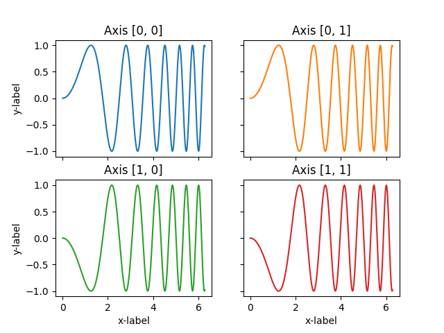
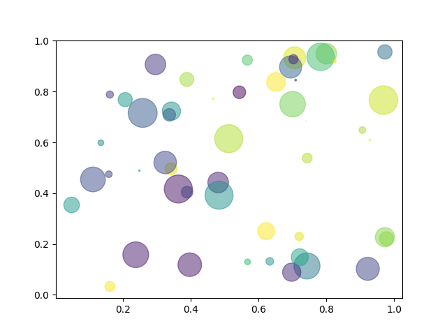
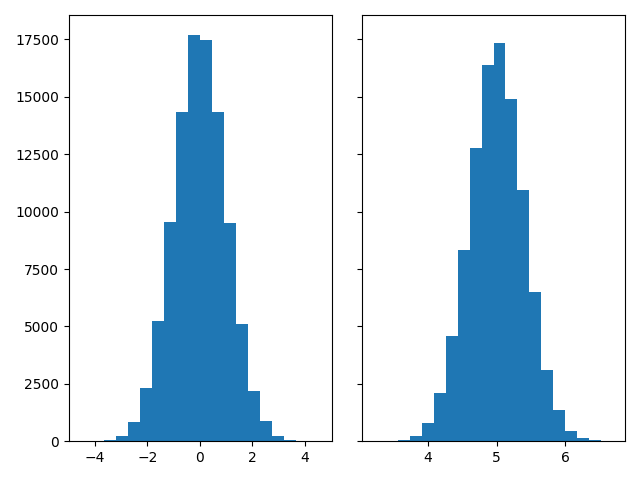
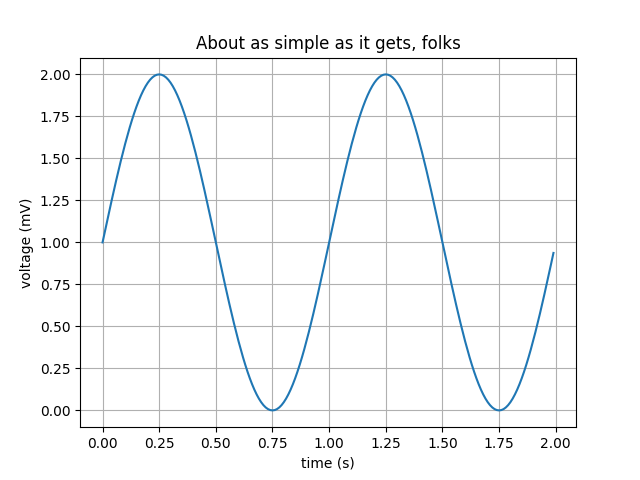

# Matplotlib

## Introduction

**Matplotlib** is a plotting library for Python. It is a very powerful library and is used by many other 
Python libraries, such as Pandas, Seaborn, and Plotly.

Matplotlib is a _relatively_ low-level library, meaning that it provides lots of flexibility to create custom plots,
while at the same time it requires more code to do so. Other libraries, such as **Seaborn**, are built on top of
Matplotlib and provide a higher-level interface.

!!!note
    This article is just an introduction to matplotlib, and is based on the
    [Matplotlib documentation](https://matplotlib.org/stable/index.html). For more details, please refer to the
    documentation.

## Plotting with subplots

Typically, we import Matplotlib as follows and then create a subplots object:

```python
import matplotlib.pyplot as plt

fig, ax = plt.subplots()
```

`subplots` is a function that returns a `Figure` object and an `Axes` object. You can imagine the `Figure` object 
as a canvas that contains all the plots that we want to create, while the `Axes` object is the actual plot (the blank 
sheet you can plot and hold your data), and is synonymous with the term _subplot_ (because each `axes` can have
several subplots).

!!!note
    To specify the number of subplots that we want to create, we can pass the `nrows` and `ncols` arguments to the
    `subplots` function. For example, to create a figure with 2 rows and 2 columns, we can do:

    ```python  
    fig, ax = plt.subplots(2, 2)
    ```

After we have called `subplots`, we can use the `plot` method of the `Axes` object to plot some data with a **line**
connecting the different data points.
The input to the `plot` method is typically two arrays, one for the x-axis and one for the y-axis. For example, 
if we have time-series data, we can plot the time on the x-axis and the values on the y-axis:

```python
ax.plot(climate_change['date'], climate_change['co2'])
ax.set(
    title='Amount of CO2 (ppm) in each year', 
    xlabel='Year',
    ylabel='Amount of CO2 (ppm)'
)
```

!!!note
    In the last example, the input to the `plot` method were two columns of a Pandas DataFrame. However, the `plot`
    method can also take two arrays as input. Basically, matplotlib `.plot(...)` requires the first two arguments to be
    of array-like type (e.g. lists, NumPy arrays, etc.), and the rest of the arguments are optional.

If we are creating several subplots at the same time, we can use the `ax` argument to specify which subplot we want
to plot on:

```python
fig, axs = plt.subplots(2, 2)
axs[0, 0].plot(x, y)
axs[0, 0].set_title('Axis [0, 0]')
axs[0, 1].plot(x, y, 'tab:orange')
axs[0, 1].set_title('Axis [0, 1]')
axs[1, 0].plot(x, -y, 'tab:green')
axs[1, 0].set_title('Axis [1, 0]')
axs[1, 1].plot(x, -y, 'tab:red')
axs[1, 1].set_title('Axis [1, 1]')
```

<figure markdown>
  { width="500" }
  <figcaption>4 subplots in a single figure.</figcaption>
</figure>

Among other parameters, `.subplots()` have two parameters to specify the grid size. nrows and ncols are used 
to point out the number of rows and columns we need respectively.

## .plot() parameters

The `.plot()` method has a lot of parameters that can be used to customize the plot. For example, we can change the
color, width and the line style of the plot:

```python
import matplotlib.pyplot as plt
import numpy as np

# Fixing random state for reproducibility
np.random.seed(19680801)

N = 50
x = np.random.rand(N)
y = np.random.rand(N)
colors = np.random.rand(N)
area = (30 * np.random.rand(N))**2  # 0 to 15 point radii

fig, axs = plt.subplots(1, 1)
ax.scatter(x, y, s=area, c=colors, alpha=0.5)
```

The color can be specified in different ways. For example, we can use the name of the color, as in the previous
example, or we can use the hexadecimal code of the color:

```python
ax.plot(x, y, color='#eeefff')
```

## Other types of plots

### Scatter plots

To create a histogram of the distribution of the data for a single 1D array, we can use the `hist` method:

```python
fig, axs = plt.subplots(1, 1)

ax.scatter(x, y, color='green'')
```

<figure markdown>
  { width="500" }
  <figcaption>A scatter plot example.</figcaption>
</figure>

### Histograms

To create a histogram of the distribution of the data for a single 1D array, we can use the `hist` method:

```python
fig, axs = plt.subplots(1, 2)

n_bins = 20

axs[0].hist(dist1, bins=n_bins)
axs[1].hist(dist2, bins=n_bins)
```

<figure markdown>
  { width="500" }
  <figcaption>A double histogram example.</figcaption>
</figure>

### Bar plots

To create a bar plot, we can use the `bar` method:

```python
fig, ax = plt.subplots(1, 1)

# Defines X-axis labels and Y-axis values
fruits = ['apple', 'blueberry', 'cherry', 'orange']
counts = [40, 100, 30, 55]
bar_labels = ['red', 'blue', '_red', 'orange']
bar_colors = ['tab:red', 'tab:blue', 'tab:red', 'tab:orange']

ax.bar(fruits, counts, label=bar_labels, color=bar_colors)
```

<figure markdown>
  { width="500" }
  <figcaption>A bar plot example.</figcaption>
</figure>


### More types of plots

You can find a list of all the different types of plots that can be created with Matplotlib in the
[Matplotlib gallery](https://matplotlib.org/3.8.1/plot_types/index.html).


## Show figure

Once the plot is ready, we can show the figure with the `show` method:
```python
plt.show()
```
This will open a new window with the figure. 

## Save figure

Finally, we can also save the figure as a file (e.g., a png or an svg file) with the `savefig` method:

```python
fig.savefig('co2_levels.png')
```

## Minimal working example

```python
import matplotlib.pyplot as plt
import numpy as np

# Create data for plotting. Any pair of 1D data can be used here,
# for example two columns of a Pandas DataFrame.
t = np.arange(0.0, 2.0, 0.01)
s = 1 + np.sin(2 * np.pi * t)

# Create figure and axes
fig, ax = plt.subplots()

# Plot data
ax.plot(t, s)

# Customize plot
ax.set(xlabel='time (s)', ylabel='voltage (mV)',
       title='About as simple as it gets, folks')

# add a grid and legend
ax.grid()
ax.legend()

# save as file and show window with plot
fig.savefig("test.png")
plt.show()
```

## Other options to customize the plot

### Legends

There are many other options that can be used to customize the plot. For example, we can add a legend to the plot
with the `legend` method:

```python
ax.legend()
```

The `legend` method will use the `label` argument of the `plot` method to create the legend. We can also specify
the location of the legend with the `loc` argument:

```python
ax.legend(loc='upper center')
```

### xlim and ylim

Another useful method is `set_xlim` and `set_ylim`, which sets the limits of the x-axis and y-axis. They are used
to only show a part of the plot, for example:

```python
ax.set_xlim([1980, 1990])
ax.set_ylim([0, 2.5])
```

### Customizing the font

We can customize the fonts of the plot defining a `fontdict` dictionary and passing it to the `set_XXX` methods:

```python
fontdict={'fontsize': 18, 'fontweight': 'bold', 'color': 'blue', 'family': 'serif'}

ax.set_title('Amount of CO2 (ppm) in each year', **fontdict)
ax.set_xlabel('Year', **fontdict)
ax.set_ylabel('Amount of CO2 (ppm)', **fontdict)
```

Another way to customize the font is to use the rcParams dictionary. This will change the default font for all the
plots. For example, to change the font size and family, we can do:

```python
plt.rcParams.update({'font.size': 18, 'font.family': 'serif'})
```

### Customizing ticks

We can customize the ticks of the plot (i.e., what numbers are shown in the x-axis and y-axis)
with the `set_xticks` and `set_yticks` methods:

```python
ax.set_xticks([1980, 1990, 2000, 2010, 2020])
ax.set_yticks([0, 1, 2, 3, 4, 5])
```

### Grid

We can also add a grid to the plot with the `grid` method:

```python
ax.grid()
```

<figure markdown>
  { width="500" }
  <figcaption>Sample figure with a grid.</figcaption>
</figure>