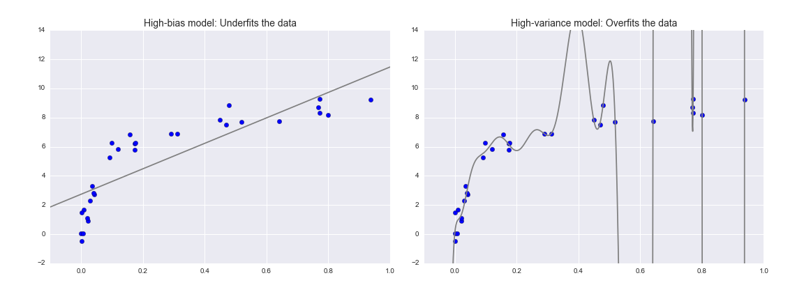
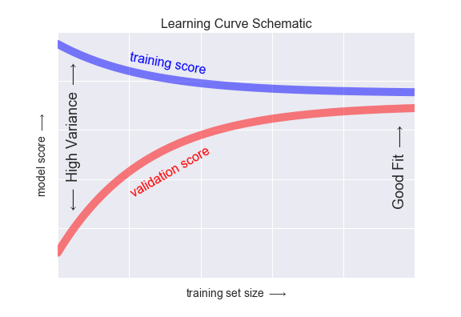
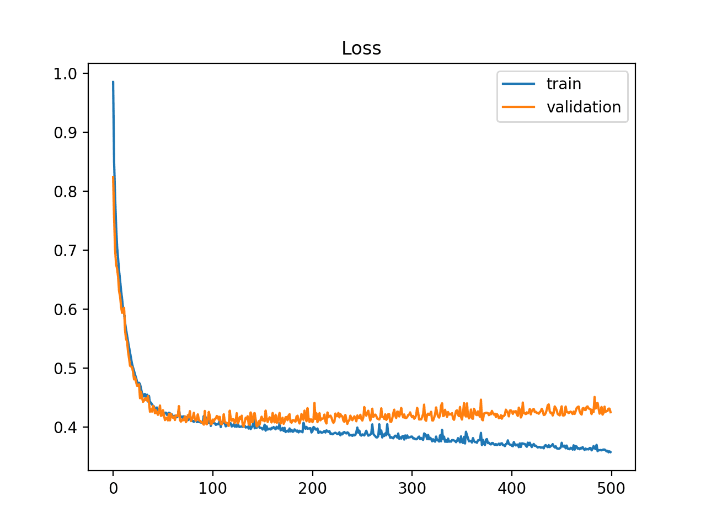

# Scikit Learn

## Overview

There are several Python libraries which provide implementations of a range of machine learning algorithms. 
One of the best known is **Scikit-Learn**, a package that provides efficient versions of a large number of common 
algorithms. Scikit-Learn is characterized by a clean, uniform, and streamlined API, as well as by very 
useful and complete online documentation. A benefit of this uniformity is that once you understand the basic 
use and syntax of Scikit-Learn for one type of model, switching to a new model or algorithm is very straightforward.

Scikit learn is built on top of NumPy, SciPy, and matplotlib. It contains a tools for classical machine learning and
statistical modeling, including classification, regression, clustering and dimensionality 
reduction. It is designed to interoperate with the Python numerical and scientific libraries 
NumPy and SciPy (but _not_ Pandas by default). In addition, it also provides a selection of sample datasets,
most of which are fairly small and well-known.

!!!note
    Scikit Learn is not designed to create neural networks / work with deep learning. For this 
    the most popular libraries are PyTorch and TensorFlow + Keras.

!!!note  
    Scikit Learn is a very large library, so we will only cover the basics here. For more information,
    check the [official documentation](https://scikit-learn.org/stable/).

## Installation

To install Scikit Learn, we can use `pip`:

```bash
pip install scikit-learn
```

or, alternatively, `poetry`:

```bash
poetry add scikit-learn
```

## Introduction

Machine learning is about creating models from data: for that reason, we'll start by discussing how data can be 
represented in order to be understood by the computer. The best way to think about data within Scikit-Learn is 
in terms of tables of data.

### Datasets

A basic table is a two-dimensional grid of data, in which the rows represent individual elements of the 
dataset, and the columns represent quantities related to each of these elements. 

!!!note
    Scikit Learn contains several datasets that can be used to test machine learning algorithms.
    To load a dataset, we can use the `load_*` functions, where `*` is the name of the dataset (e.g. `load_iris`).

For example, consider the Iris dataset, famously analyzed by Ronald Fisher in 1936:

```python
from sklearn import datasets

iris = datasets.load_iris(as_frame=True)
iris_df = iris.frame

print(iris_df.head())

# Output:
    sepal length (cm)  sepal width (cm)  petal length (cm)  petal width (cm)  target target_names
0                 5.1               3.5                1.4               0.2       0       setosa
1                 4.9               3.0                1.4               0.2       0       setosa
2                 4.7               3.2                1.3               0.2       0       setosa
3                 4.6               3.1                1.5               0.2       0       setosa
4                 5.0               3.6                1.4               0.2       0       setosa
```

!!!note
    The `as_frame=True` argument tells Scikit Learn to return a Pandas DataFrame instead of a NumPy array.
    This is useful because we can use the column names to refer to the columns, instead of using the column indices.

After calling the `load_iris()` function, we get the data from the Iris dataset. There are typically two
ways to return the data:

* As `X`, `y` arrays. Here `X` is the data (independent variables) and `y` is the target (dependent variables).
  This option can be chosen by setting `return_X_y=True` when calling the load method.

    !!!note
        The `X` and `y` names are very general and, in the context of machine learning, almost always refer to the
        data and target variables, respectively (not only in Scikit Learn, but in other libraries as well). 

* The other option is a `Bunch` object, which is similar to a dictionary (which is what we used in the previous
  example). It contains the data, the target, and other information about the dataset:

    ```python
    print(iris.keys())
  
    # Output:
    dict_keys(['data', 'target', 'frame', 'target_names', 'DESCR', 'feature_names', 'filename'])
    ```

    The values of this dictionary are, by default, NumPy arrays, except if we used `as_frame=True` when calling
    the load method, in which case they are Pandas DataFrames:

    * `data`: the data, which is a NumPy array or a Pandas DataFrame. It contains the features of the dataset (i.e,
    the independent variables). In this table, each column is a feature, and each row is an observation.
    * `target`: the target, which is a NumPy array or a Pandas DataFrame. It contains the labels of the dataset (i.e,
      the dependent variable).
    * `frame`: the data and target combined into a single DataFrame.
    * `target_names`: the names of the labels (in this case, the names of the flower species).
    * `DESCR`: the description of the dataset.
    * `feature_names`: the names of the features (in this case, the names of the flower measurements).
    * `filename`: the path to the file containing the dataset.

#### Supervised vs Unsupervised problems

When using scikit-learn, we will typically work with tables following this `data` and `target` keys convention.
This is always the case when we are working with **supervised learning** machine learning problems, where we have a
target variable that we want to predict. 

!!!note
    **Supervised problems** are, at a very high level, interpolation problems. We have a set of points, and we want to
    find a function $f(X)$ that passes through all of them, so that $f(X) \sim y$. 

    More formally, we want to minimize the error (known as the loss or cost function), 

    $$
    \min_{f} \mathcal{L}(f(X), y)
    $$
    
    By doing this, we hope that if we use the function in a new point $X'$, we will get a value $f(X')$ that is close to
    the true value of its associated $y'$.

In the Iris dataset, the target variable is the flower species, and the features are the flower measurements, so
if were to use this dataset for a machine learning problem, we would try to construct a model that predicts the 
flower species (dependent variable) from the flower measurements (independent variables).

When we are working with **unsupervised learning** machine learning problems we don't have a target variable
that we want to predict. In such cases, we will usually work with tables following the `data` *only* key convention, 
since we don't have a target variable. 

### Scikit-Learn's API

Scikit-Learn's API is designed around the following principles:

* **Consistency**: All objects share a common interface drawn from a limited set of methods, with consistent
  documentation. This means that we can learn one estimator API (i.e., methods) and other estimators will work the
  same way.
* **Inspection**: All parameter values are exposed as public attributes. This means that we can inspect
  the parameters of an estimator by looking at its attributes.
* **Limited object hierarchy**: Only algorithms are represented by Python classes; datasets are represented in
  standard formats (NumPy arrays, Pandas DataFrames, SciPy sparse matrices) and parameter names use standard Python
  strings.
* **Composition**: Many machine learning tasks can be expressed as sequences of more fundamental algorithms, and
  Scikit-Learn makes use of this wherever possible. 
* **Sensible defaults**: When models require user-specified parameters, the library defines an appropriate default
  value.

In practice, these principles make Scikit-Learn very easy to use, once the basic principles are understood.   

## Estimators' API

**Estimator** are classes from the library that implement machine learning algorithms (i.e., objects that "learn"
from data). In the context of Supervised Learning, an estimator is a Python object that implements (at least) the 
following methods:

* `fit(X, y)`: fit the model using `X` as training data and `y` as target values.
* `predict(X)`: predict the target values of `X` using the trained model.

If the prediction task is to classify the observations in a set of finite labels, in other words to “name” 
the objects observed, the task is said to be a _classification_ task. In this case, the target variable is said to be
a _categorical_ variable (i.e., a variable that can take on one of a limited, and usually fixed, number of possible
values). If, on the other hand, the target variable is a continuous target variable, it is said to be a 
_regression_ task.

### The `fit` method

The `fit` method is used to train the model, and is the first method that we should call when using an estimator (after
our data is ready, of course). It takes as input the training data and the training labels, and
trains the model. For example, to train a KNN classifier, we can do the following:

```python
from sklearn.neighbors import KNeighborsClassifier

X_train = ...
y_train = ...

knn = KNeighborsClassifier(n_neighbors=3)
knn.fit(X_train, y_train)
```

!!!note
    A K-Nearest Neightbors is an algorithm that does not fit a model to the data. Instead, it memorizes the training
    data in an internal data structure that is efficient to query. However, the example serves as an illustration that
    in Scikit Learn, the order is always the same: first we create the estimator, then we fit it to the data, then we
    use it to make predictions.
    
### The `predict` method

The `predict` method is used to make predictions. It takes as input the data to predict, and returns the predictions.
For example, to predict the labels of a test set, we can do the following:

```python
X_test = ...

y_pred = knn.predict(X_test)
```

## Transformers

SciKit learn also provides classes known as **transformers**, which are estimators (i.e., they inherit from a
base class called `BaseEstimator`) that can transform data. 

!!!note
    These transformers have nothing to do with the transformers in deep learning. 

Transformers are typically used to preprocess the data before training the model. We'll discuss some examples
in the following sections, but bear in mind that many of these transformations can be done by hand, for example
in Pandas, before going into Scikit Learn.

!!!note
    Transformers are estimators, so they also have `fit` and `predict` methods. However, the `fit` method is used to
    learn the parameters of the transformer, and the `predict` method is used to transform the data. Hence, these
    methods are not used in the same way as in estimators, which represent machine learning algorithms.

### Standard scaler

The `StandardScaler` is a transformer used to standardize the data before training a model. 
It removes the mean of the data and scales it unit variance, calculating the z-score of each sample in the dataset:
$$
z = \frac{x - u}{s}
$$
where `u` is the mean of the training samples or zero if `with_mean=False`, and `s` is the standard deviation of 
the training samples or one if `with_std=False`:

```python
from sklearn.preprocessing import StandardScaler

scaler = StandardScaler()
X_train_scaled = scaler.fit_transform(X_train)
```

!!!note
    The `fit_transform` method is a combination of the `fit` and `transform` methods. It first fits the transformer
    to the data (which in this case, although confusing, means computing the mean and std), and then transforms the 
    data. This is equivalent to calling `fit` and then `transform` separately.

### One-hot encoder

The `OneHotEncoder` is a transformer used to encode categorical features that do not have a natural ordering 
as a one-hot numeric array (i.e., a binary array with a single 1 and many 0s). 
For example, if we have a categorical feature with three possible values, `a`, `b`, and `c`, the one-hot encoding
would be:

| a | b | c |
|---|---|---|
| 1 | 0 | 0 |
| 0 | 1 | 0 |
| 0 | 0 | 1 |

```python
import pandas as pd
from sklearn.preprocessing import OneHotEncoder

X_train = pd.DataFrame({'feature': ['a', 'b', 'c']})
encoder = OneHotEncoder()

X_train_encoded = encoder.fit_transform(X_train)

print(X_train_encoded.toarray())

# Output:
[[1. 0. 0.]
 [0. 1. 0.]
 [0. 0. 1.]
```

### Ordinal encoder

The `OrdinalEncoder` is a transformer used to encode categorical features that have a natural ordering as a numeric
array. For example, if we have a categorical feature with three possible values that have a meaningful order,
e.g. `low`, `medium`, and `high`, the ordinal encoding would be:

| low | medium | high |
|-----|--------|------|
| 0   | 1      | 2    |

```python
from sklearn.preprocessing import OrdinalEncoder

X_train = pd.DataFrame({'feature': ['low', 'medium', 'high']})
encoder = OrdinalEncoder()

X_train_encoded = encoder.fit_transform(X_train)

print(X_train_encoded)

# Output:
[[0.]
 [1.]
 [2.]]
```

## Metrics

A **metric** is a function that measures the performance of a model. For example, the accuracy is a metric 
that measures the proportion of correct predictions made by a classifier, and the mean squared error is a metric
that measures the average squared difference between the predicted values and the true values of a regression model.

Scikit Learn provides a number of metrics that can be used to evaluate the performance of a model. These metrics,
or modified versions of it, are used as the loss function in the optimization problems that the models are trying 
to solve during training (i.e., when you call the `fit` method).

The Scikit learn API provides two ways to use metrics:

* **The `score` method**: The `score` method is a method that is implemented by all estimators. It takes as input
  the data and the target, and returns a score that measures the performance of the model. The score is usually
  a number between 0 and 1, where 1 means that the model is perfect and 0 means that the model is useless. Check
  the documentation of the estimator to see what score it returns.
* **The `metrics` module**: The `metrics` module contains a number of functions that can be used to evaluate the
  performance of a model. These functions take as input the true values and the predicted values, and return a score
  that measures the performance of the model. The score is usually a number between 0 and 1, where 1 means that the
  model is perfect and 0 means that the model is useless. 

!!!note
    In general, it is **not possible** to use a custom loss function in Scikit Learn. For example, if you want to use
    a different metric than vanilla mean squared error in a regression problem, you should take a look at other
    estimators that implement other loss functions. Take a look [here](https://scikit-learn.org/stable/modules/linear_model.html).


### Classification metrics

Some of the most common classification metrics are:

* **Accuracy**: The accuracy is the proportion of correct predictions made by a classifier. It is defined as:
  $$
  \text{accuracy} = \frac{\text{number of correct predictions}}{\text{total number of predictions}}
  $$
  The accuracy is a number between 0 and 1, where 1 means that the model is perfect and 0 means that the model is
  useless. The accuracy is implemented by all classifiers in Scikit Learn, and can be often computed using the `score`
  method.

    !!!note
          The accuracy is a very common metric, but it is not always the best metric to use. For example, if we have a
          dataset with 99% of the observations belonging to class A and 1% belonging to class B, a classifier that always
          predicts class A will have an accuracy of 99%, even though it is a useless classifier. In this case, a better
          metric would be the precision or the recall.

* **Confusion matrix**: The confusion matrix is a table that shows the number of correct and incorrect predictions
   made by a classifier. It is defined as:
  
    | | Predicted: 0 | Predicted: 1 |
    |---|---|---|
    | Actual: 0 | True negatives | False positives |
    | Actual: 1 | False negatives | True positives |
  
    The confusion matrix is implemented by all classifiers in Scikit Learn, and can be computed using the `confusion_matrix`
    function in the `metrics` module.

    ```python
    from sklearn.metrics import confusion_matrix
  
    y_true = [0, 1, 0, 1]
    y_pred = [1, 1, 0, 0]
  
    print(confusion_matrix(y_true, y_pred))
  
    # Output:
    [[1 1]
     [1 1]]
    ```
  
    !!!note
        The accuracy, precision, recall, etc. can all be computed from the confusion matrix.
    
* **AUROC**: The AUROC (Area Under the Receiver Operating Characteristic) is a metric that measures the performance
  of a classifier. It is defined as the area under the ROC curve, which is a curve that plots the true positive rate
  (TPR) against the false positive rate (FPR) at various threshold settings. The AUROC is a number between 0 and 1,
  where 1 means that the model is perfect and 0 means that the model is useless. The AUROC is implemented by all
  classifiers in Scikit Learn, and can be computed using the `roc_auc_score` function in the `metrics` module.

    ```python
    from sklearn.metrics import roc_auc_score
  
    y_true = [0, 1, 0, 1]
    y_pred = [1, 1, 0, 0]
  
    print(roc_auc_score(y_true, y_pred))
  
    # Output:
    0.5
    ```

    !!!note
        The AUROC is a more robust metric than the accuracy, since it is not affected by the class imbalance problem
        described above. 

### Regression metrics

Some of the most common regression metrics are:

* **Mean squared error**: The mean squared error is the average squared difference between the predicted values and
  the true values of a regression model. It is defined as:

    $$
    \text{MSE} = \frac{1}{n} \sum_{i=1}^{n} (y_i - \hat{y}_i)^2
    $$

    where $y_i$ is the true value of the $i$-th observation, $\hat{y}_i$ is the predicted value of the $i$-th observation,
    and $n$ is the number of observations. The MSE is implemented by all regressors in Scikit Learn, and can be often
    computed using the `score` method.

* **Mean absolute error**: The mean absolute error is the average absolute difference between the predicted values and
    the true values of a regression model. It is defined as:
    $$
    \text{MAE} = \frac{1}{n} \sum_{i=1}^{n} |y_i - \hat{y}_i|
    $$
    where $y_i$ is the true value of the $i$-th observation, $\hat{y}_i$ is the predicted value of the $i$-th observation,
    and $n$ is the number of observations. The MAE is implemented by all regressors in Scikit Learn, and can be often
    computed using the `score` method.

* **$R^2$ score**: The $R^2$ score is a metric that measures the proportion of variance in the dependent variable
    that is predictable from the independent variables. It is defined as:

    $$
    R^2 = 1 - \frac{\sum_{i=1}^{n} (y_i - \hat{y} \_i)^2} 
    {\sum_{i=1}^{n} (y_i - \bar{y})^2}
    $$
    where $y_i$ is the true value of the $i$-th observation, $\hat{y}_i$ is the predicted value of the $i$-th observation,
    $\bar{y}$ is the mean of the true values, and $n$ is the number of observations. The $R^2$ score is a number between
    0 and 1, where 1 means that the model is perfect and 0 means that the model is useless. The $R^2$ score is implemented
    by all regressors in Scikit Learn, and can be often computed using the `score` method.

## Model validation

Learning the parameters of a prediction function and testing it on the same data is a methodological mistake: a model 
that would just repeat the labels of the samples that it has just seen would have a perfect (or almost perfect) score 
but would fail to predict anything useful on yet-unseen data. 

!!!note
    This situation is called **overfitting**. This happens when the model learns the training data "too well". Since 
    all datasets contain some noise, eventually the model will fit to the noise as well, which will cause it to perform
    worse on new data.

### Holdout sets with `train_test_split`

To avoid this situation, it is common practice when performing a (supervised) machine learning experiment to hold out 
part of the available data. 

In scikit-learn a random split into training and test sets can be quickly computed with the `train_test_split` 
helper function. Let's use it to hold out 25% of the data for testing, in the following example:

```python
from sklearn.model_selection import train_test_split
from sklearn.metrics import accuracy_score
from sklearn.neighbors import KNeighborsClassifier


model = KNeighborsClassifier(n_neighbors=1)
X_train, X_test, y_train, y_test = train_test_split(X, y, test_size=0.25)

# fit the model on one set of data
model.fit(X_train, y_train)

# evaluate the model on the second set of data
y2_model = model.predict(X_test)
accuracy_score(y_test, y2_model)
```

### Cross-validation

One disadvantage of using a holdout set for model validation is that we have lost a portion of our data to the 
model training. In the above case, half the dataset does not contribute to the training of the model! This is 
not optimal, and can cause problems – especially if the initial set of training data is small.

One way to address this is to use cross-validation; that is, to do a sequence of fits where each subset of 
the data is used both as a training set and as a validation set. Visually, it might look something like this:

<figure markdown>
  { width="500" }
  <figcaption>Sketch of the cross-validation procedure.</figcaption>
</figure>

Here we split the data into five groups, and use each of them in turn to evaluate the model fit on the other 
4/5 of the data. This would be rather tedious to do by hand, and so we can use Scikit-Learn's `cross_val_score` 
convenience routine to do it succinctly:

```python
from sklearn.model_selection import cross_val_score

cross_val_score(model, X, y, cv=5)

# Output:
array([0.96666667, 0.96666667, 0.93333333, 0.96666667, 1.])
```

Repeating the validation across different subsets of the data gives us a better idea of the performance 
of the algorithm. What comes out are $n$ accuracy scores, which we could combine (for example, by taking the
median or the mean). 

!!!note
    When working with time series data, it is important to use cross-validation in a way that respects the time
    dependence between observations. In this case, we can use the `TimeSeriesSplit` class instead to
    perform cross-validation.


## Model hyperparameters

A model **hyperparameter** is a configuration that is external to the model and whose value cannot be estimated
from data. They represent the "knobs" of a model: the type of function used to fit the model, the number of parameters,
the regularization parameter, the network architecture (in the case of neural networks), etc.

!!!note
    Hyperparameters are different from parameters. Parameters are values that are estimated from data, such as the
    coefficients of a linear regression model, or the weights of a neural network. Hyperparameters are _everything else_.

Of core importance is the following question: if our estimator is underperforming, how should we move forward? 
There are several possible answers:

* Use a more complicated/more flexible model
* Use a less complicated/less flexible model
* Gather more training samples
* Gather more data to add features to each sample

The answer to this question is often counter-intuitive. Sometimes using a more complicated 
model will give worse results, and adding more training samples may not improve your results!

### Bias-variance trade-off

Fundamentally, the question of "the best model" is about finding a sweet spot in the tradeoff between bias and 
variance. Consider the following figure, which presents two regression fits to the same dataset:

<figure markdown>
  { width="700" }
  <figcaption>Two regression fits to the same dataset. Left: a high-bias, low-variance model; 
    Right: a low-bias, high-variance model.</figcaption>
</figure>

In general, as we increase the number of tunable parameters in a model, it becomes more flexible, 
and can better fit a training data set. It is said to have lower error, or **bias**. However, for more 
flexible models, there will tend to be greater **variance** to the model fit each time we take a set of samples 
to create a new training data set.

!!!note
    The **bias–variance trade-off** is the conflict in trying to simultaneously minimize these two sources of error.

From the previous figure, we see that (and the observation generally holds):

* For **high-bias** models, the performance of the model on the validation set is similar to the performance 
  on the training set.
* For **high-variance** models, the performance of the model on the validation set is far worse than the 
  performance on the training set.

### Validation curves

If we imagine that we have some ability to tune the model complexity, we would expect the training score 
and validation score to behave as illustrated in the following figure:

<figure markdown>
  { width="500" }
  <figcaption>A **validation curve**.
    The X axis represents the model complexity (e.g., the number of neighbors in a KNN classifier, or a polynomial
    degree in a linear regression model). The Y axis represents the score (a higher score means better model 
    performance / lower error).</figcaption>
</figcaption>
</figure>

The diagram above is a **validation curve**, and we see the following essential features:

* The training score is (almost) always better than the validation score. This is generally the case: 
    the model will be a better fit to data it has seen than to data it has not seen.
* For very low model complexity (a high-bias model), the training data is **under-fit**, which means that 
  the model is a poor predictor both for the training data and for any previously unseen data.
* For very high model complexity (a high-variance model), the training data is **over-fit**, which means 
that the model predicts the training data very well, but fails for any previously unseen data.
* For some intermediate value, the validation curve has a maximum. This is the optimal scenario, and the parameter
  value set at the maximum is the best model.

### Learning curves

One important aspect of model complexity is that the optimal model will generally depend on the size of your
training data. A **learning Curve** is a plot of the training and cross-validation error as a function of the
number of training samples. The general behavior we would expect from a learning curve is this:

* A model of a given complexity will overfit a small dataset: this means the training score will be relatively 
high, while the validation score will be relatively low.
* A model of a given complexity will underfit a large dataset: this means that the training score will decrease, 
but the validation score will increase.
* A model will never, except by chance, give a better score to the validation set than the training set: 
this means the curves should keep getting closer together but never cross.

The following figure shows a typical learning curve for a supervised learning problem:

<figure markdown>
  { width="500" }
  <figcaption>A _typical_ learning curve.</figcaption>
</figcaption>
</figure>

!!!note
    Another common type of curve are **Loss vs. epoch graphs**, where in the Y axis we have a loss function 
    to minimize (an "error") and on the X axis we have the number of epochs (iterations) of the training algorithm
    (sort of like the time axis). These curves are used to monitor the training process of a model over time,
    and to determine when to stop training. The following figure shows a loss vs. epoch graph for a neural network:

    <figure markdown>
      { width="500" }
      <figcaption>A **loss vs. epoch graph** example.</figcaption>
    </figure>


### Cross-validation including hyperparameter tuning

The preceding discussion of the validation and learning curves 
is meant to give you some intuition into the trade-off between bias and variance,
and its dependence on model complexity and training set size. In practice, models generally have more 
than one knob to turn, and thus plots of validation and learning curves change from lines to 
multi-dimensional surfaces. In these cases, such visualizations are difficult and we would rather 
simply find the particular model that maximizes the validation score.

Scikit Learn provides a number of tools to perform model selection, including cross-validation and grid search
on hyperparameters. A common way to do this is to use the `GridSearchCV` class, which implements a grid search 
with cross-validation. 

This class takes as input an estimator, a dictionary of hyperparameters, and a cross-validation strategy, and returns
the best hyperparameters for the estimator. For example, to find the best number of neighbors for a KNN classifier,
we can do the following:

```python
from sklearn.model_selection import GridSearchCV
from sklearn.neighbors import KNeighborsClassifier

X_train = ...
y_train = ...

model = KNeighborsClassifier()

param_grid = {'n_neighbors': [1, 3, 5, 7, 9]}
grid = GridSearchCV(model, param_grid, cv=5)
grid.fit(X_train, y_train)

print(grid.best_params_)
print(grid.best_score_)
```

!!!note
    The `cv` argument is the number of folds in the cross-validation. The default value is 5, but it can be changed
    to any integer.

Now that this is fit, we can ask for the best parameters as follows:

```python
grid.best_params_

# Output:
{'n_neighbors': 3}
```

The grid search provides other options, including the ability to specify a custom scoring function, 
to parallelize the computations, to do randomized searches, and more.

## Feature Engineering

All of the examples so far assume that you have numerical data in a tidy, `[n_samples, n_features]` format. 
In the real world, data rarely comes in such a form. Hence, one of the more important steps in using machine 
learning in practice is **feature engineering**: that is, taking whatever information you have about your 
problem and turning it into numbers that you can use to build your feature matrix.

!!!note
    Feature engineering is a fancy term for "creating new variables from existing variables". For example, if we have
    a dataset with a column containing the date of birth of a person, we can create a new column containing the age of
    the person by subtracting the date of birth from the current date.

## Machine learning algorithms in SKLearn

Scikit Learn provides implementations of a large number of machine learning algorithms. These algorithms are
implemented as the already discussed estimator objects, and can be used to solve a wide range of machine 
learning problems.

### Regression models

Regression is the task of predicting a continuous value. For example, predicting the price of a house is a
regression task, or predicting the height of a person. Scikit Learn provides a number of regression models that
can be used to solve regression problems.

#### Common regression models

* **Linear regression**: Linear regression is a linear model that assumes a linear relationship between the
  dependent variable and the independent variables. It is implemented by the `LinearRegression` class in the
  `linear_model` module.

    ```python
    from sklearn.linear_model import LinearRegression

    X_train = ...
    y_train = ...

    model = LinearRegression()
    model.fit(X_train, y_train)
    ```
  
* **Random forest regression**: Random forest regression is an ensemble model that fits a number of decision tree
  classifiers on various sub-samples of the dataset and uses averaging to improve the predictive accuracy and control
  over-fitting. It is implemented by the `RandomForestRegressor` class in the `ensemble` module.

    ```python
    from sklearn.ensemble import RandomForestRegressor

    X_train = ...
    y_train = ...

    model = RandomForestRegressor()
    model.fit(X_train, y_train)
    ```

#### Regression examples

https://jakevdp.github.io/PythonDataScienceHandbook/05.02-introducing-scikit-learn.html#Supervised-learning-example:-Simple-linear-regression

### Classification

Classification is the task of predicting a class from a set of classes. For example, predicting whether an email is
spam or not is a classification task, or predicting whether a person has a disease or not. Scikit Learn provides a
number of classification models that can be used to solve classification problems.

#### Common classification models

* **Logistic regression**: Logistic regression is a linear model that assumes a linear relationship between the
  log-odds of the dependent variable and the independent variables. It is implemented by the `LogisticRegression`
  class in the `linear_model` module.

    ```python
    from sklearn.linear_model import LogisticRegression

    X_train = ...
    y_train = ...

    model = LogisticRegression()
    model.fit(X_train, y_train)
    ```
    
    !!!note
        Despite its name, logistic regression is a classification algorithm, not a regression algorithm. The name
        comes from the fact that it is a regression algorithm that uses logistic functions to model the relationship
        between the dependent and independent variables. It can be used for binary classification problems or
        multi-class classification problems (i.e., problems with more than two classes).

* **K-Nearest Neighbors**: K-Nearest Neighbors is a non-parametric method used for classification and regression. 
  It is a lazy learning algorithm that does not fit a model to the data. It is implemented by the `KNeighborsClassifier`
  class in the `neighbors` module.

    ```python
    from sklearn.neighbors import KNeighborsClassifier

    X_train = ...
    y_train = ...

    model = KNeighborsClassifier()
    model.fit(X_train, y_train)
    ```

* **Random forest classification**: Random forest classification is an ensemble model that fits a number of decision
    tree classifiers on various sub-samples of the dataset and uses averaging to improve the predictive accuracy and
    control over-fitting. It is implemented by the `RandomForestClassifier` class in the `ensemble` module.
    
        ```python
        from sklearn.ensemble import RandomForestClassifier
    
        X_train = ...
        y_train = ...
    
        model = RandomForestClassifier()
        model.fit(X_train, y_train)
        ```

#### Examples

https://jakevdp.github.io/PythonDataScienceHandbook/05.02-introducing-scikit-learn.html#Supervised-learning-example:-Iris-classification

### Clustering

#### Examples 

https://jakevdp.github.io/PythonDataScienceHandbook/05.02-introducing-scikit-learn.html#Unsupervised-learning:-Iris-clustering


### Dimensionality reduction

#### Examples

https://jakevdp.github.io/PythonDataScienceHandbook/05.02-introducing-scikit-learn.html#Unsupervised-learning-example:-Iris-dimensionality


## Annex: common pitfalls in ML

### Curse of dimensionality

The curse of dimensionality refers to various phenomena that arise when analyzing and organizing data in 
high-dimensional spaces that do not occur in low-dimensional settings such as the three-dimensional physical 
space of everyday experience. 

In machine learning, the curse of dimensionality is often used to refer to the fact that the performance of many
machine learning algorithms degrades as the number of features increases. This is because, as the number of features
increases, the number of observations required to obtain a good model increases exponentially with the number of
features.

### Overfitting

Overfitting is a modeling error that occurs when a function is too closely fit to a limited set of data points.
Overfitting the model generally takes the form of making an overly complex model to explain idiosyncrasies in the data
under study. In reality, the data being studied often has some degree of error or random noise within it. Thus,
attempting to make the model conform too closely to slightly inaccurate data can infect the model with substantial
errors and reduce its predictive power.

### Underfitting

Underfitting occurs when a statistical model or machine learning algorithm cannot capture the underlying trend of the
data. Intuitively, underfitting occurs when the model or the algorithm does not fit the data well enough. More 
specifically, underfitting occurs if the model or algorithm shows low variance but high bias. 
Underfitting is often a result of an excessively simple model.

### Data leakage

Data leakage is a problem that occurs when information about the target variable is inadvertently introduced into the
training data. This can cause the model to perform unrealistically well during training, but perform poorly during
testing.

!!!note
    If we are not careful with time series data when splitting the data into training and test sets, we can introduce 
    data leakage by using information from the future to predict the past!    

### Class imbalance

Class imbalance is a problem that occurs when the number of observations in each class is not equal. This can cause
problems when training a model, since the model will tend to predict the most common class. For example, if we have
a dataset with 99% of the observations belonging to class A and 1% belonging to class B, a classifier that always
predicts class A will have an accuracy of 99%, even though it is a useless classifier. In this case, a better
metric would be the AUROC.

## Other

- **Clustering**: Clustering is the task of grouping data points into clusters. For example, grouping customers into
  clusters based on their purchase history is a clustering task.
- **Dimensionality reduction**: Dimensionality reduction is the task of reducing the number of features in a dataset.
  For example, reducing the number of features in an image to the most important ones is a dimensionality reduction
  task.