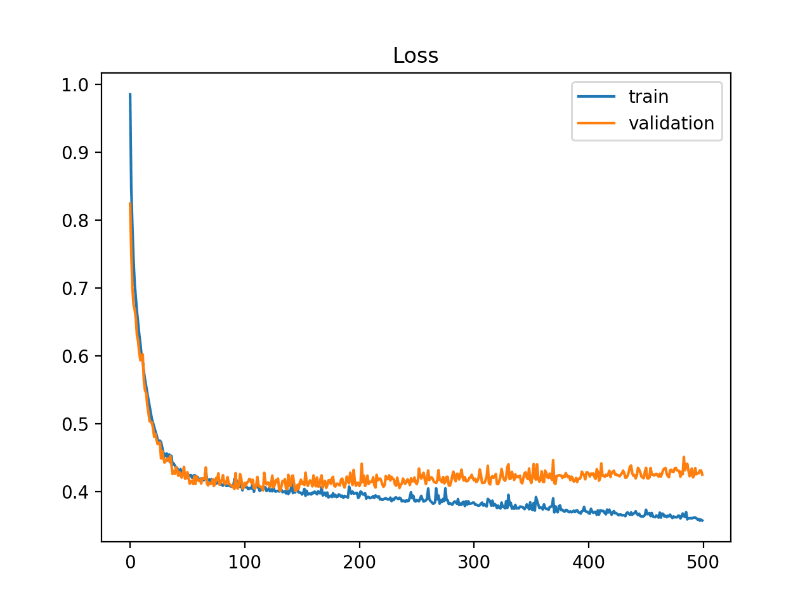

# Annex

## Model evaluation intuition

When we are working with machine learning models, we are interested in finding the best model for our problem.
How should we proceed if our model is underperforming? There are several possible answers:

* Use a more complicated/more flexible model
* Use a less complicated/less flexible model
* Gather more training samples
* Gather more data to add features to each sample

Which of the previous to use is sometimes counter-intuitive. A more complicated 
model could give worse results, and perhaps adding more training samples does not improve your results either.

### Bias-variance trade-off

The question of "the best model" is about finding a sweet spot in the tradeoff between bias and 
variance. Consider the following figure, which presents two regression fits to the same dataset:

<figure markdown>
  { width="700" }
  <figcaption>Two regression fits to the same dataset. Left: a high-bias, low-variance model; 
    Right: a low-bias, high-variance model.</figcaption>
</figure>

In general, as we increase the number of tunable parameters in a model, it becomes more flexible, 
and can better fit a training data set. It is said to have lower error, or **bias**. However, for more 
flexible models, there will tend to be greater **variance** to the model fit each time we take a set of samples 
to create a new training data set.

!!!note
    The **bias–variance trade-off** is the conflict in trying to simultaneously minimize these two sources of error.

From the previous figure, we see that (and the observation generally holds):

* For **high-bias** models, the performance of the model on the validation set is similar to the performance 
  on the training set.
* For **high-variance** models, the performance of the model on the validation set is far worse than the 
  performance on the training set.

### Validation curves

If we imagine that we have some ability to tune the model complexity, we would expect the training score 
and validation score to behave as illustrated in the following figure:

<figure markdown>
  { width="500" }
  <figcaption>A validation curve example.
    The X axis represents the model complexity (e.g., the number of neighbors in a KNN classifier, or a polynomial
    degree in a linear regression model). The Y axis represents the score (a higher score means better model 
    performance / lower error).</figcaption>
</figcaption>
</figure>

The diagram above is a **validation curve**, and we see the following essential features:

* The training score is (almost) always better than the validation score. This is generally the case: 
    the model will be a better fit to data it has seen than to data it has not seen.
* For very low model complexity (a high-bias model), the training data is **under-fit**, which means that 
  the model is a poor predictor both for the training data and for any previously unseen data.
* For very high model complexity (a high-variance model), the training data is **over-fit**, which means 
that the model predicts the training data very well, but fails for any previously unseen data.
* For some intermediate value, the validation curve has a maximum. This is the optimal scenario, and the parameter
  value set at the maximum is the best model.

### Learning curves

One important aspect of model complexity is that the optimal model will generally depend on the size of your
training data. A **learning Curve** is a plot of the training and cross-validation error as a function of the
number of training samples. The general behavior we would expect from a learning curve is this:

* A model of a given complexity will overfit a small dataset: this means the training score will be relatively 
high, while the validation score will be relatively low.
* A model of a given complexity will underfit a large dataset: this means that the training score will decrease, 
but the validation score will increase.
* A model will never, except by chance, give a better score to the validation set than the training set: 
this means the curves should keep getting closer together but never cross.

The following figure shows a typical learning curve for a supervised learning problem:

<figure markdown>
  { width="500" }
  <figcaption>A typical learning curve.</figcaption>
</figcaption>
</figure>

### Loss vs. epoch graphs

Another common type of training curves are **Loss vs. epoch graphs**, where in the Y axis we have a loss function 
to minimize (an "error") and on the X axis we have the number of epochs (iterations) of the training algorithm
(sort of like the time axis). 

These curves are used to monitor the training process of a model over time,
and to determine when to stop training (typically when the loss function is not decreasing anymore, and
before it starts increasing again). The following figure shows a loss vs. epoch graph for a neural network:

<figure markdown>
  { width="500" }
  <figcaption>A **loss vs. epoch graph** example.</figcaption>
</figure>

## Common pitfalls

### Overfitting

Overfitting is a modeling error that occurs when a function is too closely fit to a limited set of data points.
Overfitting the model generally takes the form of making an overly complex model to explain idiosyncrasies in the data
under study. In reality, the data being studied often has some degree of error or random noise within it. Thus,
attempting to make the model conform too closely to slightly inaccurate data can infect the model with substantial
errors and reduce its predictive power.

### Underfitting

Underfitting occurs when a statistical model or machine learning algorithm cannot capture the underlying trend of the
data. Intuitively, underfitting occurs when the model or the algorithm does not fit the data well enough. More 
specifically, underfitting occurs if the model or algorithm shows low variance but high bias. 
Underfitting is often a result of an excessively simple model.

### Data leakage

Data leakage is a problem that occurs when information about the target variable is inadvertently introduced into the
training data. This can cause the model to perform unrealistically well during training, but perform poorly during
testing.

!!!note
    If we are not careful with time series data when splitting the data into training and test sets, we can introduce 
    data leakage by using information from the future to predict the past!    

### Class imbalance

Class imbalance is a problem that occurs when the number of observations in each class is not equal. This can cause
problems when training a model, since the model will tend to predict the most common class. For example, if we have
a dataset with 99% of the observations belonging to class A and 1% belonging to class B, a classifier that always
predicts class A will have an accuracy of 99%, even though it is a useless classifier. In this case, a better
metric would be the AUROC.

### Curse of dimensionality

The curse of dimensionality refers to various phenomena that arise when analyzing and organizing data in 
high-dimensional spaces that do not occur in low-dimensional settings such as the three-dimensional physical 
space of everyday experience. 

In machine learning, the curse of dimensionality is often used to refer to the fact that the performance of many
machine learning algorithms degrades as the number of features increases. This is because, as the number of features
increases, the number of observations required to obtain a good model increases exponentially with the number of
features.