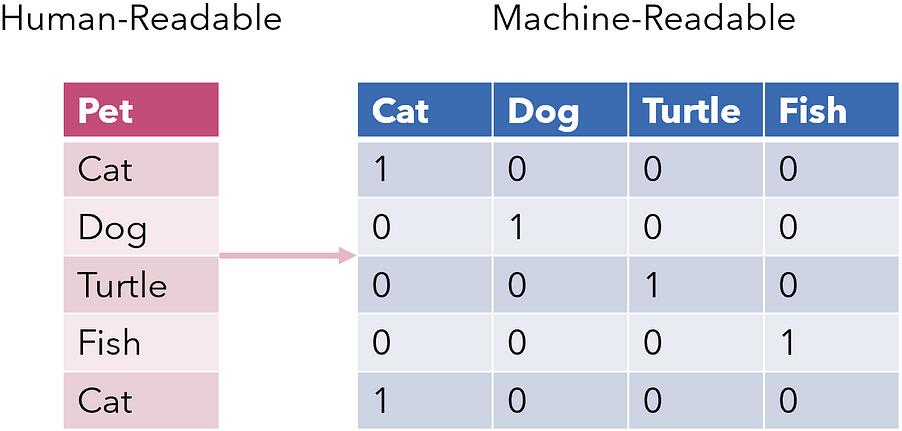

# Feature Engineering

All of the examples so far assume that you have numerical data in a tidy, `[n_samples, n_features]` format.
That may be the case when we load data from a SKLearn dataset, but it is not the case in the real world, where
data rarely comes in such a form. 

Hence, one of the more important steps in using machine learning in practice is **feature engineering**: that is, 
taking whatever information you have about your problem and turning it into numbers that you can use to 
build your feature matrix.

!!!note
    Feature engineering is a fancy term for "creating new variables from existing variables". For example, if we have
    a dataset with a column containing the date of birth of a person, we can create a new column containing the age of
    the person by subtracting the date of birth from the current date.

!!!note
    Proper data cleaning is also an important part of feature engineering. Some common data cleaning tasks include:

    * **Missing values**: Most machine learning algorithms cannot handle missing values. There are several ways to deal
      with missing values, including removing the observations with missing values, imputing the missing values with the
      mean or median, or using a machine learning algorithm that can handle missing values.
    * **Outliers**: Outliers are observations that are far away from the rest of the observations. Outliers can have a
      significant effect on the model, so it is important to detect and (if it is justified to do so) remove them. 

## Transformers

Scikit learn provides classes known as **transformers**, which are estimators (i.e., they inherit from a
base class called `BaseEstimator`) that can transform data instead of making predictions. 

!!!note
    Transformers are estimators, so they also have the `fit` method. However, this method is used to
    learn the parameters of the transformer (e.g., the mean of the data in a `StandardScaler`), not to train a model.
    They also don't have the `predict` method, since they don't make predictions. Instead, they have the
    `transform` method, which is used to transform the data.

Transformers are typically used to preprocess the data _before_ training the model, and hence
they are an important part of feature engineering.

!!!note
    We'll discuss some examples belows, but bear in mind that it is not necessary to use transformers 
    or Scikit learn to preprocess the data. Many of these transformations can be done "by hand", for example
    in Pandas, before going into Scikit Learn.

!!!note
    These transformers have nothing to do with the transformers in deep learning. 

### Standard scaler

The `StandardScaler` is a transformer used to standardize the data before training a model. 
It removes the mean of the data and scales it to unit variance, calculating the z-score of each sample in the dataset:
$$
z = \frac{x - u}{s}
$$
where `u` is the mean of the training samples (or zero if `with_mean=False`), and `s` is the standard deviation of 
the training samples or one if `with_std=False`:

```python
from sklearn.preprocessing import StandardScaler

scaler = StandardScaler()
X_train_scaled = scaler.fit_transform(X_train)
```

!!!note
    The `fit_transform` method is a combination of the `fit` and `transform` methods. It first fits the transformer
    to the data (which in this case, although confusing, means computing the mean and std), and then transforms the 
    data. This is equivalent to calling `fit` and then `transform` separately.

### Ordinal encoder

The `OrdinalEncoder` is a transformer used to encode categorical features that have a natural ordering as a numeric
array. For example, if we have a categorical feature with three possible values that have a meaningful order,
e.g. `low`, `medium`, and `high`, the ordinal encoding would be:

| low | medium | high |
|-----|--------|------|
| 0   | 1      | 2    |

```python
from sklearn.preprocessing import OrdinalEncoder

X_train = pd.DataFrame({'feature': ['low', 'medium', 'high']})
encoder = OrdinalEncoder()

X_train_encoded = encoder.fit_transform(X_train)

print(X_train_encoded)

# Output:
[[0.]
 [1.]
 [2.]]
```

### One-hot encoder

The `OneHotEncoder` is a transformer used to encode categorical features that do not have a natural ordering 
as a one-hot numeric array (i.e., a binary array with a single 1 and many 0s). 
For example, if we have a categorical feature with three possible values, `a`, `b`, and `c`, the one-hot encoding
would be:

| a | b | c |
|---|---|---|
| 1 | 0 | 0 |
| 0 | 1 | 0 |
| 0 | 0 | 1 |

```python
import pandas as pd
from sklearn.preprocessing import OneHotEncoder

X_train = pd.DataFrame({'feature': ['a', 'b', 'c']})
encoder = OneHotEncoder()

X_train_encoded = encoder.fit_transform(X_train)

print(X_train_encoded.toarray())

# Output:
[[1. 0. 0.]
 [0. 1. 0.]
 [0. 0. 1.]
```

### Tfidf vectorizer

The `TfidfVectorizer` is a transformer used to convert text data into a numerical feature matrix.
It is a combination of the `CountVectorizer` and `TfidfTransformer` transformers.

```python
from sklearn.feature_extraction.text import TfidfVectorizer

X_train = ['This is the first document.',
           'This is the second second document.',
           'And the third one.',
           'Is this the first document?']
           
vectorizer = TfidfVectorizer()
X_train_encoded = vectorizer.fit_transform(X_train)
```

!!!note
    You can read more about Tf-idf [here](https://en.wikipedia.org/wiki/Tf%E2%80%93idf).

To see the vocabulary that was learned by the vectorizer, we can use the `get_feature_names` method:

```python
print(vectorizer.get_feature_names())

# Output:
['and', 'document', 'first', 'is', 'one', 'second', 'the', 'third', 'this']
```


## Types of features

The following sections describe a few general tricks of feature engineering.

### Categorical features

One common type of non-numerical data is categorical data. 
To use this data in a machine learning model, we need to convert this categorical feature to a numerical feature.

If the categorical feature has no natural ordering, we can use one-hot encoding to convert it to a numerical
feature. 

<figure markdown>
  { width="400" }
  <figcaption>One-hot encoding.</figcaption>
</figcaption>
</figure>

If the categorical feature has a natural ordering, we can use ordinal encoding to convert it to a regular
number.

### Text features

Another common type of non-numerical data is text data. To use this data in a machine learning
model, we need to convert this text feature to a numerical feature. This can be done using several NLP techniques. 
Check **bag-of-words**, [**TF-IDF**](https://scikit-learn.org/stable/modules/generated/sklearn.feature_extraction.text.TfidfVectorizer.html), 
and **word embeddings** for more information.

### Date features

Another common type of non-numerical data is date data. To use this data in a machine learning
model, we need to convert this date feature to a numerical feature. This can be done by extracting the year, month,
day, etc. from the date and using them as numerical features. 

Date features are very important in time series, which naturally has seasonality and trends. For this, 
sometimes it is a good idea to use extra dummy variables to be able to
express all dates that are close to each other (e.g., the day of the week, the number of the week, etc.).

!!!note
    An example: we can use the week numbers as features, but with this ordinal encoding we can't express that 
    week 52 and week 1 are actually close to one another. However, we could *also* add a new feature that is 
    the week number plus 26, and then model might be able to understand that weeks "live" in a circle instead 
    of in a line.

### Image features

Another common type of data are images. Although they might look like non-numerical data, images are actually
matrices of numbers. To use this data in a machine learning, the easiest way is to flatten the image and use the
pixels as numerical features (often even deleting the color channels).

Then, we can "spaghettify" the image by flattening the image and converting it to a 1D vector. 

### Derived features

Sometimes, we can create new features from existing features. For example, if we have a dataset with a column
containing the date of birth of a person, we can create a new column containing the age of the person by subtracting
the date of birth from the current date. 

For numerical data, we can often apply mathematical transformations to create new features that have a better
behavior for the model, or that change the data distribution to one that is more suitable. This needs to be done
on a case-by-case basis, and requires some domain knowledge.

!!!note
    Example: imagine that we have a dataset with a column containing the price of a house. We can create a new column
    containing the logarithm of the price of the house. This (could) make the data distribution more suitable for
    the model by reducing the tail of the distribution.

## Feature selection

In some cases, we might have too many features, which makes the model too complex and costly to maintain. In such cases
we will need to select only the most important ones. This can be achieved in several ways:

* With dimensionality reduction techniques, such as **PCA**.
* With feature importance techniques, such as the **SHAP values** (and simpler alternatives). 

!!!note
    **Rules of thumb to know if a feature is important**: 
    1. Add noise to it and see if the model performance decreases. If it does, the feature is probably important. 
    2. Create new features with values drawn from a random distribution. Then, train a model and scrap all features
       that perform similarly to the random noise features.