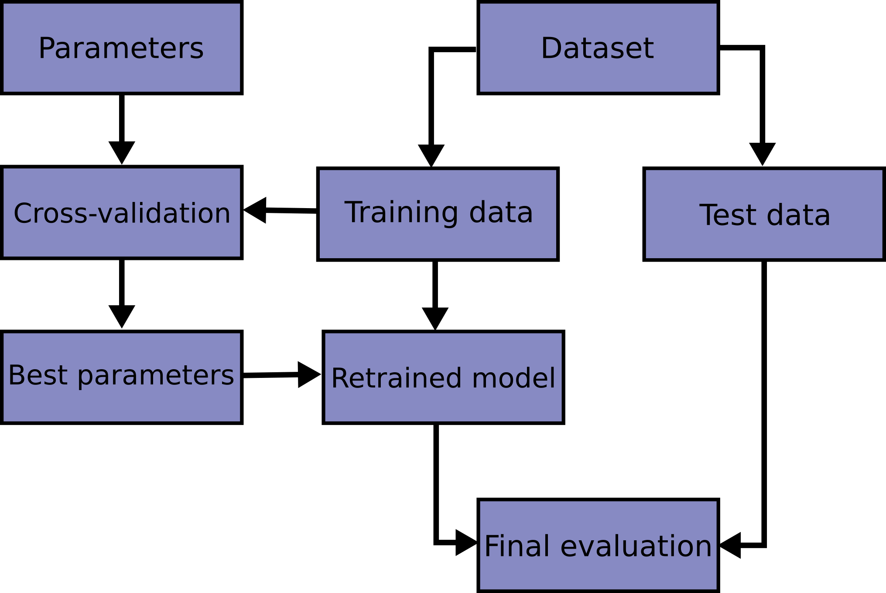

# Metrics and validation

This section describes a series of related concepts that are important when choosing the best model for a given
problem. In particular, we'll see:

* What are metrics and how to use them to evaluate the performance of a model.
* What is model validation and how to use it to choose the best model for a given problem.
* What are model hyperparameters and how to use cross-validation to find the best hyperparameters for a given model.
* What is feature engineering and selection, and how to use it to improve the performance of a model.

!!!note
    A model **hyperparameter** is a configuration that is not a _parameter_ (for example the
    coefficients of a linear regression model, or the weights of a neural network), and hence their value cannot 
    be estimated from input data. They represent the "knobs" of a model: the number of parameters,
    the regularization parameter, the network architecture (in the case of neural networks), etc. 

## Metrics

A **metric** is a function that measures the performance of a model. For example, the accuracy is a metric 
that measures the proportion of correct predictions made by a classifier, and the mean squared error (MSE) 
is a metric that measures the average squared difference between the predicted values and the true values 
of a regression model.

Scikit Learn provides a number of metrics that can be used to evaluate the performance of a model. These metrics,
or modified versions of it, are used as the loss function $\mathcal{L}(\ldots)$ 
in the optimization problems that the models are trying to solve during training 
(i.e., when you call the `fit` method).

The Scikit learn API provides two ways to use metrics:

* **The `score` method**: The `score` method is a method that is implemented by all estimators. It takes as input
  the data and the target, and returns a score that measures the performance of the model. The score is usually
  a number between 0 and 1, where 1 means that the model is perfect and 0 means that the model is useless. 

    !!!note
        The default score method depends on the type of estimator. For example, the default score method for
        classifiers is the accuracy, and the default score method for regressors is the $R^2$ score. 

* **The `metrics` module**: The `metrics` module contains many functions that can be used to evaluate the
  performance of a model. If we don't want to use the default score method, we can use these functions instead.

### Classification metrics

Some of the most common classification metrics are:

* **Accuracy**: The accuracy is the proportion of correct predictions made by a classifier. It is defined as:
  $$
  \text{accuracy} = \frac{\text{number of correct predictions}}{\text{total number of predictions}}
  $$
  The accuracy is a number between 0 and 1, where 1 means that the model is perfect and 0 means that the model is
  useless. The accuracy is implemented by all classifiers in Scikit Learn, and can be often computed using the `score`
  method.

    !!!note
          The accuracy is a very common metric, but it is not always the best metric to use. For example, if we have a
          dataset with 99% of the observations belonging to class A and 1% belonging to class B, a classifier that always
          predicts class A will have an accuracy of 99%, even though it is a useless classifier. In this case, a better
          metric would be the precision or the recall.

* **Confusion matrix**: The confusion matrix is a table that shows the number of correct and incorrect predictions
   made by a classifier. It is defined as:
  
    | | Predicted: 0 | Predicted: 1 |
    |---|---|---|
    | Actual: 0 | True negatives | False positives |
    | Actual: 1 | False negatives | True positives |
  
    The confusion matrix is implemented by all classifiers in Scikit Learn, and can be computed using the `confusion_matrix`
    function in the `metrics` module.

    ```python
    from sklearn.metrics import confusion_matrix
  
    y_true = [0, 1, 0, 1]
    y_pred = [1, 1, 0, 0]
  
    print(confusion_matrix(y_true, y_pred))
  
    # Output:
    [[1 1]
     [1 1]]
    ```
  
    !!!note
        The accuracy, precision, recall, etc. can all be computed from the confusion matrix.
    
* **AUROC**: The AUROC (Area Under the Receiver Operating Characteristic) is a metric that measures the performance
  of a classifier. It is defined as the area under the ROC curve, which is a curve that plots the true positive rate
  (TPR) against the false positive rate (FPR) at various threshold settings. The AUROC is a number between 0 and 1,
  where 1 means that the model is perfect and 0 means that the model is useless. The AUROC is implemented by all
  classifiers in Scikit Learn, and can be computed using the `roc_auc_score` function in the `metrics` module.

    ```python
    from sklearn.metrics import roc_auc_score
  
    y_true = [0, 1, 0, 1]
    y_pred = [1, 1, 0, 0]
  
    print(roc_auc_score(y_true, y_pred))
  
    # Output:
    0.5
    ```

    !!!note
        The AUROC is a more robust metric than the accuracy, since it is not affected by the class imbalance problem
        described above. 

### Regression metrics

Some of the most common regression metrics are:

* **Mean squared error**: The mean squared error is the average squared difference between the predicted values and
  the true values of a regression model. It is defined as:

    $$
    \text{MSE} = \frac{1}{n} \sum_{i=1}^{n} (y_i - \hat{y}_i)^2
    $$

    where $y_i$ is the true value of the $i$-th observation, $\hat{y}_i$ is the predicted value of the $i$-th observation,
    and $n$ is the number of observations. The MSE is implemented by all regressors in Scikit Learn, and can be often
    computed using the `score` method.

* **Mean absolute error**: The mean absolute error is the average absolute difference between the predicted values and
    the true values of a regression model. It is defined as:
    $$
    \text{MAE} = \frac{1}{n} \sum_{i=1}^{n} |y_i - \hat{y}_i|
    $$
    where $y_i$ is the true value of the $i$-th observation, $\hat{y}_i$ is the predicted value of the $i$-th observation,
    and $n$ is the number of observations. The MAE is implemented by all regressors in Scikit Learn, and can be often
    computed using the `score` method.

* **$R^2$ score**: The $R^2$ score is a metric that measures the proportion of variance in the dependent variable
    that is predictable from the independent variables. It is defined as:

    $$
    R^2 = 1 - \frac{\sum_{i=1}^{n} (y_i - \hat{y} \_i)^2} 
    {\sum_{i=1}^{n} (y_i - \bar{y})^2}
    $$
    where $y_i$ is the true value of the $i$-th observation, $\hat{y}_i$ is the predicted value of the $i$-th observation,
    $\bar{y}$ is the mean of the true values, and $n$ is the number of observations. The $R^2$ score is a number between
    0 and 1, where 1 means that the model is perfect and 0 means that the model is useless. The $R^2$ score is implemented
    by all regressors in Scikit Learn, and can be often computed using the `score` method.

## Regularization

When training a model, we are trying to find the parameters that minimize a certain loss function $\mathcal{L}(\ldots)$.
For example, in a linear regression model, we are trying to find the coefficients that minimize the MSE.

However, in some cases, we might want to add a penalty to the loss function to **prevent the model from overfitting**,
leading to a new loss function 

$$\mathcal{L}(\ldots) + \lambda \mathcal{R}(\ldots),$$

where $\mathcal{R}(\ldots)$ is the **regularization term** and $\lambda$ is the regularization parameter. Intuitively,
this term penalizes the model for being too complex, with the goal of reducing the generalization error of the model
to unseen data. 

Depending on the type of regularization term, we can have different types of regularization, the most common being:

* **L1 regularization**: In L1 regularization, the regularization term is the sum of the absolute values of the
  parameters: $\mathcal{R}(\ldots) = \sum_{i=1}^{n} |w_i|$. This type of regularization is also known 
  as **Lasso regularization**.
* **L2 regularization**: In L2 regularization, the regularization term is the sum of the squared values of the
  parameters, $\mathcal{R}(\ldots) = \sum_{i=1}^{n} w_i^2$. 
  This type of regularization is also known as **Ridge regularization** (and also as 
  **Tikhonov regularization**). 
* **Elastic Net regularization**: a combination of L1 and L2 regularization. 
  
!!!note
    Both the L1 and L2 regularization terms encourage the coefficients to be small, since they effectively penalize
    large coefficients. However, they act in slightly different ways.
    L1 regularization tends to set the coefficients of the least important features to zero, sometimes 
    effectively performing feature selection (so, in a way, it sparsifies the coefficients).
    L2 regularization, on the other hand, tends to shrink the coefficients
    towards zero, but not _exactly_ to zero (since it depends on the square of the coefficients, and when a
    coefficient is small, its square becomes negligible).
    

In general, it is **not possible** to use a custom loss function in Scikit Learn. For example, if you want to use
a different metric than vanilla mean squared error in a regression problem, you should take a look at _other_
estimators that implement other loss functions, such as `Ridge` or `Lasso` (see the [linear models](linear_models.md).

However, some estimators allow you to specify directly the regularization term and the regularization parameter, 
without having to look for a different estimator. This is the case of the Logistic Regression classifier, for example,
and really depends on the estimator in question. 

## Model optimization and training

Getting the best possible model for a given problem is a complex process, but we can
simplify it to two steps:

1. First, we need to choose the best model for the problem. Assuming that we have a family of candidate models, 
   differing in their hyperparameters, we need to choose the best hyperparameters for the problem.
2. Second, once the final model is clear, we need to train the model on the data. 

The two steps are actually related, since the best hyperparameters for a model depend on the data, but 
we can study them separately.

### Training and testing a model

Assume for now that we have chosen the best model for the problem. The next step is to fit the model to the data.
Learning the parameters of a model and making predictions on the same data used to fit the model 
is a methodological mistake. In an extreme case, a model that would just repeat the labels of the samples that it has 
just seen would have a perfect performance with seen data, but would fail to predict anything on yet-unseen data. 

!!!note
    A model that works well on the training data but fails to generalize to new data is said to **overfit**.
    This happens when the model learns the training data "too well". Since all datasets contain some noise, 
    eventually the model will fit to the (random) noise as well, causing it to perform worse on new data.

To avoid this situation, when performing a (supervised) machine learning experiment we almost always 
split the data into two sets: a **training set** and a **testing set**.

* The **training set** is used to fit the model (i.e., to learn the parameters of the model that minimize the loss
  function).
* The **testing set** is used to evaluate the performance of the model on new data after the model has been trained.

In scikit-learn a random split into training and test sets can be quickly computed with the `train_test_split` 
helper function. Let's use it to keep 25% of the data for testing in the following example:

```python
from sklearn.model_selection import train_test_split
from sklearn.metrics import accuracy_score
from sklearn.neighbors import KNeighborsClassifier


model = KNeighborsClassifier(n_neighbors=1)
X_train, X_test, y_train, y_test = train_test_split(X, y, test_size=0.25)

# fit the model on one set of data
model.fit(X_train, y_train)

# evaluate the model on the second set of data
y2_model = model.predict(X_test)
accuracy_score(y_test, y2_model)
```

!!!note
    This function makes a _random_ split of the data. If you don't care about the split type, you can just slice the
    data manually. However, in some cases this will lead to the training
    data and the test data having different statistical properties, which is not ideal.

### Cross-validation

Now let's go a step back and assume that we have a family of candidate models, differing in their hyperparameters.
We would like to find the best hyperparameters for the model, but for this we would need to repeat the previous
procedure: split the training data into a set for training each model (defined by certain hyperparameters)
and another for testing the model with those hyperparameters. In the end, we would be training the model
with only a fraction of the data, and furthermore, perhaps the hold-out set would not be representative of the
entire dataset (for example, it could happen that the chosen models perform well on the hold-out set, but
poorly on the rest of the data).

One way to address this is to use cross-validation; that is, to do a sequence of fits where each subset of 
the data is used both as a training set and as a validation set. Visually, it might look something like this:

<figure markdown>
  { width="500" }
  <figcaption>Sketch of the cross-validation procedure.</figcaption>
</figure>

In the figure example, we split the data into five groups, and use each of them in turn to evaluate the model 
fit on the other 4/5 of the data. Repeating the validation across different subsets of the data gives us a 
better idea of the performance of the algorithm. What comes out are $n$ accuracy scores, which we can 
combine to get one final measure of the model's performance (we can combine them for example by taking the mean). 

Scikit-Learn provides `cross_val_score` to do this process automatically:

```python
from sklearn.model_selection import cross_val_score

cross_val_score(model, X, y, cv=5)

# Output:
array([0.96666667, 0.96666667, 0.93333333, 0.96666667, 1.])
```

!!!note
    When working with time series data, it is important to use cross-validation in a way that respects the time
    dependence between observations. In this case, we can use the `TimeSeriesSplit` class instead to
    perform cross-validation.

### Cross-validation including hyperparameter tuning

The following plot shows the **validation curve** for a hypothetical model. The validation curve is a plot of the
validation score (i.e., the score on the validation set) and training score (i.e., the score on the training set)
as a function of a hyperparameter:

<figure markdown>
  { width="500" }
  <figcaption>A validation curve example.
    The X axis represents the model complexity. The Y axis represents the score (a higher score means better model 
    performance / lower error).</figcaption>
</figcaption>
</figure>

It's important to emphasize some aspects of this figure:

* The left section of the plot shows an **underfitting** model: the training and validation scores are both low.
* The middle section shows a good fit: the training and validation scores are both high, and the difference between
  them is small. Most importantly, the validation score is at a maximum.
* The right section shows an **overfitting** model: the training score is high, but the validation score is low.

In practice, models generally have more than one "knob" (i.e. hyperparameter) to turn, and thus a validation plot
becomes multi-dimensional. In such cases, visualizations are difficult and we would rather simply find the 
particular model that maximizes the validation score.

Scikit Learn provides a number of tools to perform model selection, including cross-validation and grid search
on hyperparameters. The whole process might look something like this flow chart:

<figure markdown>
  { width="400" }
  <figcaption>Sketch of the cross-validation procedure (grid search case).</figcaption>
</figure>

#### Grid search

A common way to do this is to use the `GridSearchCV` class, which implements a grid search 
with cross-validation. 

This class takes as input an estimator, a dictionary of hyperparameters, and a cross-validation strategy, and returns
the best hyperparameters for the estimator. For example, to find the best number of neighbors for a KNN classifier,
we can do the following:

```python
from sklearn.model_selection import GridSearchCV
from sklearn.neighbors import KNeighborsClassifier

X_train = ...
y_train = ...

model = KNeighborsClassifier()

param_grid = {'n_neighbors': [1, 3, 5, 7, 9]}
grid = GridSearchCV(model, param_grid, cv=5)
grid.fit(X_train, y_train)

print(grid.best_params_)
print(grid.best_score_)
```

!!!note
    The `cv` argument is the number of folds in the cross-validation. The default value is 5, but it can be changed
    to any integer. In the extreme case where `cv` is equal to the number of observations, we have _leave-one-out_
    cross-validation, where we train the model on all but one observation, and test it on the remaining observation.

Now that we have fit the model, we can ask for the best parameters as follows:

```python
grid.best_params_

# Output:
{'n_neighbors': 3}
```

The grid search provides other options, including the ability to specify a custom scoring function, 
to parallelize the computations, to do randomized searches, and more.

#### Randomized search

In some cases, the number of hyperparameters is too large to do an exhaustive search. In such cases, we can use
a randomized search instead. This is done with the `RandomizedSearchCV` class, which is similar to the `GridSearchCV`
class, but instead of trying all possible combinations of hyperparameters, it tries a random subset of them.

```python
from sklearn.model_selection import RandomizedSearchCV
from sklearn.neighbors import KNeighborsClassifier

X_train = ...
y_train = ...

model = KNeighborsClassifier()

param_grid = {'n_neighbors': [1, 3, 5, 7, 9]}
grid = RandomizedSearchCV(model, param_grid, cv=5)
grid.fit(X_train, y_train)

print(grid.best_params_)
print(grid.best_score_)

# Output:
{'n_neighbors': 3}
```