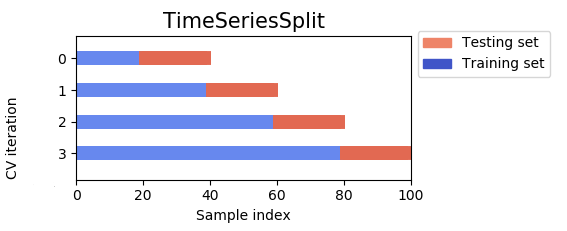

# Time series forecasting

## Introduction

Time series forecasting is the task of predicting future values of a time series, i.e., a sequence of observations
taken sequentially in time. This is a very common task in many domains, such as finance, weather, retail, etc. 

Time series forecasting is a type of regression problem in supervised learning, where the input features are 
the previous values of the time series, and the target is the next value of the time series. The features of a
time series problem are called **lags**. For example, if we want to predict the value of a time series at time `t`,
we can use the values of the time series at times `t-1`, `t-2`, `t-3`, etc. as features.

However, in practice we can enrich the features of a time series problem by adding other features that are not
necessarily previous observations of the time series. For example, if we want to predict the price of a stock
at time `t`, we can use the price of the stock at time `t-1`, `t-2`, `t-3`, etc. as features, but we can also
use other features such as the price of other stocks, the weather, etc. In any case, the features of a time series
are naturally tabular data (and can be encoded in pandas DataFrames).

!!!note
    The fact that the data is sequential in time means that we need to be careful when splitting the data into 
    training and test sets.

## Basic time series processing

Pandas provides some basic tools for time series processing. Sometimes it's not necessary to embark on a 
big time series forecasting project, and we can get away with some simple transformations of the data.

Pandas provides the following (simple) tools for time series processing:

* `shift`: shifts the values of a time series by a given number of steps. This is useful to create lags of the
  time series, i.e., to create features that are the previous values of the time series. For example, to create
  a lag of 1 of a time series, we can do the following:

    ```python
    df['lag_1'] = df['time_series'].shift(1)
    ```

* `diff`: computes the difference between consecutive values of a time series. For example, to create a feature 
  that is the difference between the current value of the time series and the
  previous value of the time series, we can do the following:

    ```python
    df['diff_1'] = df['time_series'].diff(1)
    ```

* `rolling`: computes a rolling statistic of a time series. For example, to compute the rolling mean (alternatively
  known as moving average) of a time series for the last 3 observations, we can do the following:

    ```python
    df['rolling_mean_3'] = df['time_series'].rolling(window=3).mean()
    ```
    The `window` parameter specifies the number of observations to use to compute the rolling statistic (it returns
    `NaN` for the first `window` observations, where there are not enough observations to compute the rolling statistic).
    It can be used with the `mean()`, as in the example above, but also with other functions such as `sum()`, `min()`,
    `max()`, etc.

!!!note
    For more advanced time series and signal processing, we can use the `SciPy` library 
    (and its `scipy.signal` module).

## Time series in SKLearn

Unfortunately, Scikit Learn does not contain any of the classical time series models such as ARIMA, SARIMA, etc. 
However, it does contain some tools that can be useful for time series forecasting, such as the `TimeSeriesSplit`,
and some *generalist* models that can be used for time series forecasting, such as the `RandomForestRegressor`.

### TimeSeriesSplit

The `TimeSeriesSplit` is a cross-validation strategy that is useful for time series data. It is similar to the
`KFold` strategy, but it differs in that the training data in each fold always comes before the test data.

<figure markdown>
  { width="400" }
  <figcaption>Regular K-fold cross validation.</figcaption>
</figcaption>
</figure>

<figure markdown>
  { width="400" }
  <figcaption>Time series split cross validation.</figcaption>
</figcaption>
</figure>

The reason to do this different split is that in time series forecasting we need to predict the future values of 
the time series using **only** the past values of the time series, since this is what we will have access to in
practice. 

!!!note
    This is easily seen with an example: predicting the price of an asset for next Monday, using information 
    from the previous Sunday and the Tuesday _after_ said Monday is much easier than predicting Monday's price 
    using only information from the past; also, in practice we will not have access to data from the future :) 

We can use the `TimeSeriesSplit` with the `cross_val_score` function to perform cross-validation on time series
data:

```python
from sklearn.model_selection import cross_val_score, TimeSeriesSplit

X = ... # Features, that include the time series from the past
y = ... # Target, that is the time series shifted one step into the future

tscv = TimeSeriesSplit(n_splits=5)
cross_val_score(model, X, y, cv=tscv)
```

### Models for time series forecasting

As mentioned before, Scikit Learn does not contain any of the classical time series models, but
we can nonetheless use a `RandomForestRegressor` to perform time series forecasting. When training models
for time series, we always have two options to choose from:

* Recursive multi-step forecasting: in this case, we train a model to predict the next value of the time series
  given the previous values of the time series. Then, we use the model to predict the next value of the time series,
  and we use this prediction to predict the next value of the time series, and so on. This option has the advantage
  that we only need to train one model, but it has the disadvantage that we have no control over how the errors
  propagate over time.

    <figure markdown>
      { width="400" }
      <figcaption>Recursive multistep prediction diagram.</figcaption>
    </figcaption>
    </figure>

* Direct multi-step forecasting: in this case, we train `n` different models to predict the next 
  `n` values of the time series. 

    <figure markdown>
      { width="400" }
      <figcaption>Direct multistep prediction diagram.</figcaption>
    </figcaption>
    </figure>

!!!note
    The `RandomForestRegressor` is a good choice for time series forecasting because it can handle time series
    data, but can also handle other types of features to enrich the model.

    Sometimes, ARIMA models can even be used to generate features for a `RandomForestRegressor` model. 

!!!note
    Alternatives to the `RandomForestRegressor` for time series forecasting are the boosted trees from 
    external libraries such as XGBoost or CatBoost. Neural networks are starting to be used for time series
    forecasting as well, but they are not yet as popular as the previous options (and require much more data
    to perform reasonably well).

    

