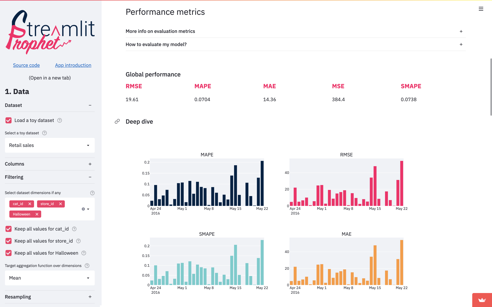

# Streamlit

Streamlit is an open-source Python library to create and share custom web apps, specifically tailored
for machine learning and data science projects. It allows you to build and deploy very quickly machine
learning graphs, data visualizations, and dashboards.

<figure markdown>
  { width="600" }
  <figcaption>A sample time series Streamlit app.</figcaption>
</figure>


The official documentation is available [here](https://docs.streamlit.io/get-started) and is very
easy to follow.

!!!note
    Also, Streamlit has a very active community and a lot of resources available online, such as tutorials,
    blog posts, and videos. Since it has been around for a few years, you can also use ChatGPT to 
    make mockups of your Streamlit app very quickly, which you can then tailor to your needs.

## Installation

You can install Streamlit with `pip`:

```bash
pip install streamlit
```

Or, in a poetry project:

```bash
poetry add streamlit
```

## Minimal example

The following is a minimal example of a Streamlit app. It is a simple app that has only one line of code,

```python
import streamlit as st

st.write("Hello, world!")
```

To run the app, save the previous code in a file, for example `my_app.py`, and run it with:

```bash
streamlit run my_app.py
```

!!!note
    Streamlit works by running a Python script that creates a web app. The script is executed from top to bottom,
    and the web app is updated whenever the script is modified. This makes it very easy to develop and test
    web apps, as you can see the changes in real time.

## Data flow

Streamlit's architecture allows you to write apps the same way you write plain Python scripts. 
Streamlit apps have a unique data flow: any time something must be updated on the screen, Streamlit 
reruns your entire Python script from top to bottom.

This can happen in two situations:

* Whenever you modify your app's source code.
* Whenever a user interacts with widgets in the app. For example, when dragging a slider, 
entering text in an input box, or clicking a button.

Whenever a callback is passed to a widget via the on_change (or on_click) parameter, the callback 
will always run before the rest of your script. For details on the Callbacks API, please refer to 
our Session State API Reference Guide.

## Display and style data

There are a few ways to display data (tables, arrays, data frames) in Streamlit apps. 
Below, you will be introduced to `st.write()`, which can be used to write anything from text to tables. 
After that, let's take a look at methods designed specifically for visualizing data.

### Write a data frame

`st.write()` is Streamlit's _Swiss Army knife_. You can pass almost anything to `st.write()`: text, data, 
Matplotlib figures, Altair charts, and more. Don't worry, Streamlit will figure it out and render things 
the right way.
    
```python
import streamlit as st
import pandas as pd

st.write("Here's our first attempt at using data to create a table:")
st.write(pd.DataFrame({
    'first column': [1, 2, 3, 4],
    'second column': [10, 20, 30, 40]
}))
```

!!!note
    There are other data specific functions like `st.dataframe()` and `st.table()` that you can also use 
    for displaying data. If you use a more specific Streamlit method you can pass additional 
    arguments to customize its behavior. Check the official documentation for more details.

### Draw a pyplot figure

You can use `st.pyplot()` to display Matplotlib figures. Here's an example:

```python
import streamlit as st
import matplotlib.pyplot as plt

arr = [3, 1, 2, 3]
fig, ax = plt.subplots()
ax.barh(['A', 'B', 'C', 'D'], arr)
st.pyplot(fig)
```

### Widgets

Streamlit has a wide range of widgets that you can use to interact with your app, like:

* `st.slider()`: A slider widget for selecting a value from a range.
* `st.selectbox()`: A select widget for selecting a single value.
* `st.multiselect()`: A multiselect widget for selecting multiple values.
* `st.button()`: A button widget for user input.
* `st.checkbox()`: A checkbox widget for boolean values, used to hide or show elements.
 
and many others. You can also use `st.text_input()` and `st.text_area()` to get text input from the user.

## Layout

Streamlit apps are built using a layout system that is designed to be simple and flexible.
Streamlit makes it easy to organize your widgets in a left panel sidebar with `st.sidebar`. 
Each element that's passed to `st.sidebar` is pinned to the left, allowing users to focus on the content 
in your app while still having access to UI controls.

For example, if you want to add a selectbox and a slider to a sidebar, use `st.sidebar.slider`
and `st.sidebar.selectbox` instead of `st.slider` and `st.selectbox`:

```python
import streamlit as st

# Add a selectbox to the sidebar:
add_selectbox = st.sidebar.selectbox(
    'How would you like to be contacted?',
    ('Email', 'Home phone', 'Mobile phone')
)

# Add a slider to the sidebar:
add_slider = st.sidebar.slider(
    'Select a range of values',
    0.0, 100.0, (25.0, 75.0)
)
```

## Separate pages

Streamlit apps can contain multiple pages, which are defined in separate `.py` files in a pages folder.
To create a new page, you can create a new `.py` file in the pages folder and define a function that
will be called when the page is opened. For example, if you have a file `pages/home.py` with the following
content:

```python
import streamlit as st

def app():
    st.title("Home")
    st.write("Welcome to the home page!")
```

You can then create a file `app.py` with the following content:

```python
import streamlit as st
from pages import home

PAGES = {
    "Home": home
}

st.sidebar.title('Navigation')
selection = st.sidebar.radio("Go to", list(PAGES.keys()))
page = PAGES[selection]
page.app()
```

When you run `app.py`, you will see a sidebar with a radio button to select the page to display. 
When you select a page, the corresponding function will be called and the content of the page will be displayed.

## App model summary

Now that you know a little more about all the individual pieces, let's close the loop and review how it works together:

1. Streamlit apps are Python scripts that run from top to bottom.
2. Every time a user opens a browser tab pointing to your app, the script is executed and a new session starts.
3. As the script executes, Streamlit draws its output live in a browser.
4. Every time a user interacts with a widget, your script is re-executed and Streamlit redraws its output in the 
  browser. The output value of that widget matches the new value during that rerun.
5. Scripts use the Streamlit cache to avoid recomputing expensive functions, so updates happen very fast.
6. Session State lets you save information that persists between reruns when you need more than a simple widget.
7. Streamlit apps can contain multiple pages, which are defined in separate .py files in a pages folder.

<figure markdown>
  { width="600" }
  <figcaption>App model summary.</figcaption>
</figure>


## How do I build a Streamlit app, in practice?

In practice, to build a Streamlit app, you start from a template (which you can find either in the official documentation,
from the Streamlit community, or you can prototype it with ChatGPT). 
Then, you modify the template to fit your needs, adding widgets, data visualizations, and other elements as needed.

You can find a lot of examples in this page of the 
[official documentation](https://docs.streamlit.io/get-started/tutorials/create-a-multipage-app)