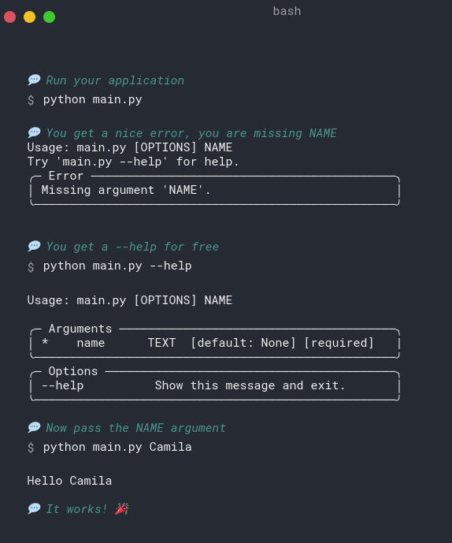

# Typer

Typer is a library for building command-line interface (CLI) applications in Python. It is built on top of 
[Click](https://click.palletsprojects.com/en/7.x/) (another popular CLI library) and makes it very easy 
to build complex CLI applications by providing a clean interface for defining commands and arguments.

<figure markdown>
  { width="500" }
  <figcaption>A screenshot of Typer from a terminal.</figcaption>
</figure>

## Installation

Typer can be installed with `pip`:

```bash
pip install typer
```

Or, in a poetry project:

```bash
poetry add typer
```

## Creating a CLI with Typer

It is recommended to use Typer in a Python project with a clean directory structure. This makes it easier to
organize the code and to add new commands and arguments. In what follows, we will assume that the project
directory structure looks like this:

```bash
.
├── my_project # The directory containing the project code
│   ├── __main__.py # The file that will be used to run the CLI
│   ├── cli # The directory containing the CLI code
│   │   ├── __init__.py # A file that contains links to the commands
│   │   ├── command_1.py
│   │   ├── ... # Other commands
│   │   └── command_n.py
│   └── ... # Other project code, unrelated to the CLI
```

where `cli` is a folder inside the `my_project` directory. In this last example, our CLI has several commands
(`command1`, ...) and a `__main__.py` file, inside the `my_project` directory, that will be used to run the CLI.

### Writing a simple CLI

We will make a simple CLI that has two commands. The first is the command `say`, which has 3 subcommands:
`hello`, `goodbye`, and `greet`: the `hello` command will print `"Hello, world!"`, the `goodbye` command 
will print `"Goodbye, it is <time> and we should go to sleep"`, where `<time>` is the current time in the 
format `HH:MM`, and the `greet` command will take a name as an argument and print "`Hello, <name>!"`.
The second command is the `operate` command, which only has the subcommand `add`: it will take two numbers 
as arguments and print their sum.

!!!note
    The commands are completely unrelated to each other. In a more realistic machine learning project, the
    commands would be related to each other and would be used to train, evaluate, etc. a machine learning model.

Let's start first by creating the code for the commands. After that, we will create the `__init__.py` and the
`__main__.py` files.

### The `say` command

We will first create the `say` command, which has 3 subcommands, and then we will review them one by one.
We should create a file called `say.py` inside the `cli` directory, containing the following code:

```python
# Path: cli/say.py

from typer import Typer, Option
import datetime

app = Typer()

@app.command("hello", help="Prints 'Hello, world!'")
def hello():
    """Prints 'Hello, world!'."""
    print("Hello, world!")
    return


@app.command("goodbye", help="Prints 'Goodbye, it is <time> and we should go to sleep'")
def goodbye():
    """Prints 'Goodbye, it is <time> and we should go to sleep'."""
    now = datetime.datetime.now()
    print(f"Goodbye, it is {now.hour}:{now.minute} and we should go to sleep")
    return


@app.command("greet", help="Prints 'Hello, <name>!'")
def greet(name: str = Option(..., "--name", "-n", help="The name to greet")):
    """Prints 'Hello, <name>!'."""
    print(f"Hello, {name}!")
    return
```

#### The `hello` command

The `hello` command is the simplest of the three commands. It does not take any arguments and simply prints
"Hello, world!" when it is called. 

The `hello` command is defined as a function with the `@app.command()` decorator. The `@app.command()` decorator
tells Typer that this function is a command and should be added to the CLI. The `hello` command does not take
any arguments, so it does not need to take any parameters. 

As we see in this example, creating a command is as simple as defining a function and decorating it with the
`@app.command()` decorator.

!!!note
    The `app` is a Typer app, the main object provided by Typer to create CLIs. It is created 
    with `app = typer.Typer()` 

!!!note
    Commands are defined in regular Python files. This means that any Python code, any imports, etc.
    can be used inside a command.

#### The `goodbye` command

The `goodbye` command is a bit more complex than the `hello` command. It prints
"Goodbye, it is <time> and we should go to sleep", where `<time>` is the current time in the format `HH:MM`.
It imports the `datetime` library to get the current time and then prints the message.

The `goodbye` command is defined similarly to the `hello` command, with a function that is slightly more complex.

#### The `greet` command

The `greet` command is a bit more complex because it takes a name as an argument (the previous commands had no 
arguments/options).

The Option `--name` (or `-n`), imported from the Typer library, is used to define the argument (in this case
`name`) that the `greet` command takes. The `...` in `Option(..., help="The name to greet")`
is used to tell Typer that the `name` argument is required. 


If we wanted to make the `name` argument optional, we could have used `None` instead of `...`

!!!note
    The `help` argument is used to provide a description of the argument. This description will be shown
    when the `--help` option is used in a terminal.

### The `operate` command

Since it is unrelated to the rest of the `say` commands, we have included `add` in a
differentiated `operate` command file (but, of course, how to structure the code is up to you). The 
`operate` command only has one subcommand: `add`, the arithmetic addition. It takes two numbers as arguments 
and prints their sum.

```python
# Path: cli/operate.py

from typer import Typer, Option


app = Typer()

@app.command("add", help="Prints the sum of two numbers")
def add(
    number_1: float = Option(..., "--number_1", "-n", help="The first number"),
    number_2: float = Option(..., "--number_2", "-m", help="The second number"),
):
    """Prints the sum of two numbers."""
    print(number_1 + number_2)
    return
```

!!!note
    The `--` and `-` in `Option(..., "--number_1", "-n", help="The first number")` are used to define the long and short
    versions of the option. For example, the `--number_1` option can be used as `--number_1 1` or `-n 1`.


### The `__init__.py` file

We now need to group the commands together and create a single Typer app. This is done in the `__init__.py` file
(which, again, is a regular Python file, even if it has a strange name). The code for this file is:

```python
# Path: my_project/__init__.py

"""**CLI access point**.

With this module we enable the ``python -m my_project``
functionality.

The CLI should also be accessible through the command:
``my_project``.
"""

from typer import Typer

from my_project.cli.say import app as say
from my_project.cli.operate import app as operate


app = Typer()
app.add_typer(say, name="say")
app.add_typer(operate, name="operate")
```

### The `__main__.py` file

The `__main__.py` file inside the `my_project` directory is what allows us to run the CLI with:

```bash
python -m my_project <command>
```

The code for this file is as simple as:

```python
"""**CLI access point**.

With this module we enable the ``python -m my_project``
functionality.

The CLI should also be accessible through the command:
``my_project``.
"""

from my_project.cli import app

if __name__ == "__main__":
    app()
```

!!!note
    The chosen name for the CLI is `my_project`, but of course this can be changed to whatever you want.


## Running the CLI

### Basic usage

After creating the CLI, we can run it from a terminal with:

```bash
python -m my_project <command>
```

where `<command>` is one of the commands defined in the `__init__.py` file. For example, we can run the
`hello` command with:

```bash
python -m my_project say hello

# Output:
Hello, world!
```

If we need help with the CLI, we can use the `--help` option:

```bash
python -m my_project --help

# Output:
Usage: example_cli [OPTIONS] COMMAND [ARGS]...

Options:
  --install-completion  Install completion for the current shell.
  --show-completion     Show completion for the current shell, to copy it or
                        customize the installation.
  --help                Show this message and exit.

Commands:
  operate
  say
```

### Get rid of `python -m`

We can get rid of the `python -m` part by adding the following code to the `pyproject.toml` file:

```toml
[tool.poetry.scripts]
my_project = "my_project.__main__:app"
```

After that, we can install the CLI with:

```bash
poetry install
```

We should see something like:

```bash
Installing dependencies from lock file

No dependencies to install or update

Installing the current project: example-cli (0.1.0)
```

Now, we can run the CLI with:

```bash
my_project <command>
```
