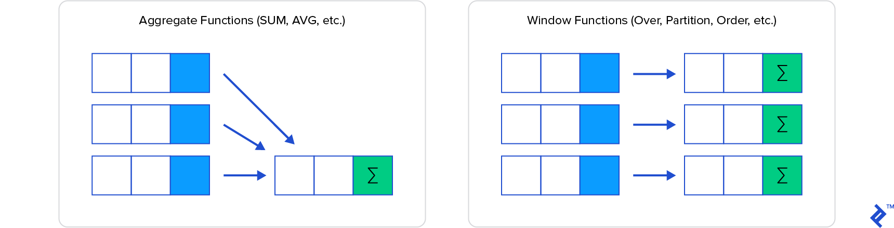

# Window functions

A **window function** is a type of Select statement that performs a calculation across a set of table rows, which
are somehow related to the current row. This is comparable to the type of calculation that can be done with an aggregate 
function but, unlike regular aggregate functions, use of a window function does not cause rows to 
become grouped into a single output row; the rows retain their separate identities. 

<figure markdown>
  { width="700" }
  <figcaption>Group by vs. Window functions.</figcaption>
</figure>

Behind the scenes, the window function is able to access more than just the current row of the query result.

## Syntax

The `OVER` clause is what specifies a window function and must always be included in the statement. 
The default in an OVER clause is the entire rowset. As an example, let’s look at an employee table in a 
company database and show the total number of employees on each row, along with each employee’s info, 
including when they started with the company.

```sql
SELECT COUNT(*) OVER() As NumEmployees, firstname, lastname, date_started
FROM Employee
ORDER BY date_started;
```
```
NumEmployees	firstname	lastname	date_started
3	John	Smith	2019-01-01 00:00:00.000
3	Sally	Jones	2019-02-15 00:00:00.000
3	Sam	    Gordon	2019-02-18 00:00:00.000
```

The above, like many window functions, can also be written with a regular subquery:

```sql
SELECT
(SELECT COUNT(*) FROM Employee) as NumEmployees, firstname, lastname, date_started
    FROM Employee
ORDER BY date_started;
```

But now, let’s say we wish to show the number of employees who started in the same month as the 
employee in the row. We will need to narrow or restrict the count to just that month for each row. 
How is that done? We use the window PARTITION clause, like so:

```sql
SELECT COUNT(*) OVER (PARTITION BY MONTH(date_started),YEAR(date_started)) 
As NumPerMonth, 
DATENAME(month,date_started)+' '+DATENAME(year,date_started) As TheMonth,
firstname, lastname
FROM Employee
ORDER BY date_started;
```

```
NumPerMonth	TheMonth	Firstname	Lastname
1	January  2019	John	Smith
2	February 2019	Sally	Jones
2	February 2019	Sam	    Gordon
```

!!!note 
    Partitions allow you to filter the window into sections by a certain value or values. In contrast to
    GROUP BY, the PARTITION BY clause does not reduce the number of rows returned by the query. In the last
    example, if we used a `Group By` clause to calculate the number of employees that started in a particular month
    instead of a `Partition By`, we would have gotten only two rows, one for January 2019 and another for February 2019.
    Hence, we would be losing the information about each particular employee.

To take it further, let’s say we not only wanted to find out how many employees started in the 
same month, but we want to show in which order they started that month. For that, we can use the 
familiar `ORDER BY` clause. However, within a window function, `ORDER BY` acts a bit differently than 
it does at the end of a query.

```sql
SELECT COUNT(*) OVER (PARTITION BY MONTH(date_started), YEAR(date_started) 
ORDER BY date_started) As NumThisMonth,
    DATENAME(month,date_started)+' '+DATENAME(year,date_started) As TheMonth,
    firstname, lastname, date_started
FROM Employee
ORDER BY date_started;
```
```
NumThisMonth	TheMonth	Firstname	lastname
1	January  2019	John	Smith
1	February 2019	Sally	Jones
2	February 2019	Sam	    Gordon
```

In this case, `ORDER BY` modifies the window so that it goes from the start of the partition 
(in this case the month and year of when the employee started) to the current row. Thus, the count 
restarts at each partition.
